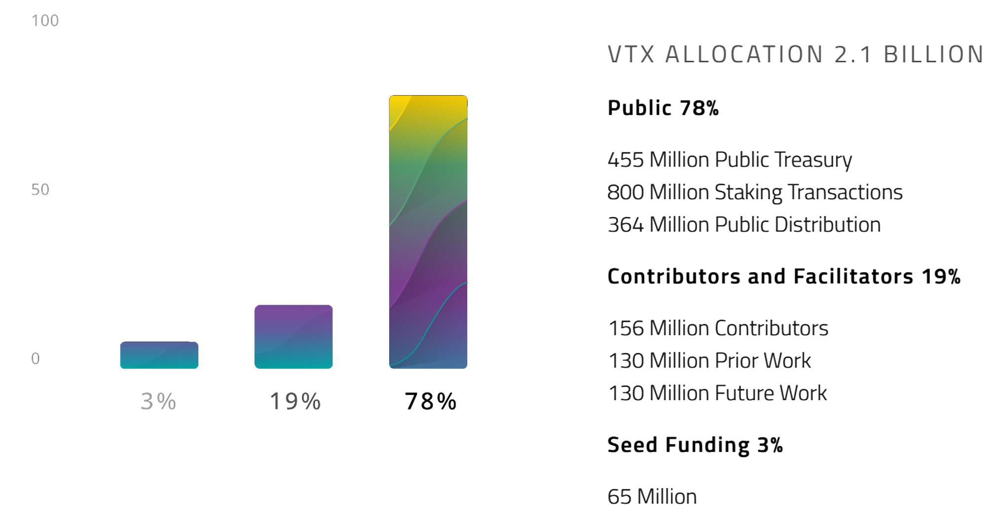

# الوثيقة البيضاء الخاصة بـ VOLENTIX وVDEX

- الإصدار: 0.1.4
- تاريخ التحديث: 11-03-2019
- الموقع الإلكتروني: www.volentix.io

## 1. المقدمة

Volentix تقدم VDex المصمم كموزع ومنصة تبادل لا مركزية لتبادل الأصول الرقمية مع التركيز على تجربة المستخدم وتنمية المجتمع والحوكمة. من خلال النفاذ إلى التقنيات المعمول بها والتخطيط لبروتوكولات جديدة مختارة مع إعطاء الأولوية للأمان، السرعة، الإستيثاق، سهولة الاستخدام، قابلية التوسع ودعم الأصول المتعددة، تعتزم VDex تسهيل معاملات النظير إلى النظير من خلال تجميع مجموعة من التطبيقات اللامركزية المبنية على العقود الذكية الخاصة بـ EOS.IO.

تستبق نقطة تشغيل VDex مطابقة متطلبات تصميم Volentix إلى التكنولوجيات المتاحة التي تم تركيبها على نظام التشغيل اللامركزي الخاص بـ EOS.IO. نعتزم إختبار إفتراضاتنا عن طريق النماذج الأولية عبر برنامج EZEOS المخصص، الذي قمنا ببنائه وتخصيصه بإستخدام أدوات الأوامر النصية الخاصة بـ EOS.IO. البرنامج موجود على: https://github.com/Volentix/ezeos

## 2. VOLENTIX

بيئة Volentix سوف تقوم على أربعة دعائم أي مجموعة مهيئة من التطبيقات المعروفة على وجه التحديد بـ Vespucci ،Verto ،Venue وVDex.

### 1.2 VENUE

تم التخطيط لـ Venue ليكون منصة إجتماعية حيوية تقوم بإستقطاب وتنظيم أعضاء مجتمع Volentix لتسهيل توزيع VTX، الأصول الرقمية الأصلية لبيئة Volentix، ولتعزيز الوعي بمبادرات Volentix.

ستمكن Venue التي تم إطلاقها مؤخرا بشكل تجريبي (beta) المستخدمين من تلقي VTX مقابل القيام بالعديد من الأشياء، مثل ما هو الحال مع المشاركة في تطوير مجتمعات مخصصة، تقديم تقارير إصلاحات الأخطاء والمطالبة بالمكافآت. تعكس لوحة المتصدرين والمقاييس المباشرة مدى مشاركة المستخدم. تم إطلاق أول حملة توقيع على منتدى /https://bitcointalk.org في 13 جويلية، 2018. الرجاء زيارة https://venue.volentix.io للمزيد من المعلومات.

### 2.2 VERTO

يتم بناء Verto كمحفظة متعددة العملات للإستخدام مع المبادل اللامركزي الخاص بـ VDex، وتعتزم المحفظة تسهيل الوصاية الشخصية والإدارة المحلية للمفاتيح الخاصة والعامة في معاملات النظير إلى النظير بهدف القضاء على مخاطر الخسائر المدمرة المرتبطة بفشل المشغلين المركزيين. تخطط Verto لتوظيف نظام من العقود الذكية للحفاظ على الحالة بين عميلين تجاريين، أبسط العمليات يتم إنجازها من خلال مقايضات ذرية.[1]

### 3.2 VESPUCCI

من المتوقع أن يكون Vespucci بمثابة محرك تحليلي يمكن الوصول إليه عبر واجهة سهلة الاستخدام مع مجموعة قيمة من بيانات السوق الحقيقية والتاريخية، مثل تقييمات الأصول الرقمية وتحليل نزعة السوق. نرغب في تزويد المستخدمين بأدوات لرسم ومقارنة الأصول الرقمية القابلة للتداول، الوصول إلى سجلات التداول التاريخية وتحليلها، رسم الاتجاهات والأنماط، مراقبة وتقييم تطوير البرمجيات المفتوحة المصدر. يسعى Vespucci إلى أن يوفر في متناول يديك بيانات موثوقة وشاملة متعلقة بالسوق من خلال تجميع المعلومات المنتشرة حاليًا عبر العديد من سلاسل الكتل المختلفة، مواقع الويب، غرف الدردشة ومنصات التبادل.

### 4.2 VDEX

الدعامة الرابعة لـ Volentix والمتمثلة في منصة VDex للتبادل هي عبارة عن منصة الأصول الرقمية القابلة للتداول والتي تم تقديمها بالتفصيل في هذه الوثيقة البيضاء. لإستخدام سهل، سلسل، وآمن. نخطط لدمج VDex مع محفظة Verto الشخصية الخاصة بك وواجهة Vespucci. نتوقع أن تكون VDex قادرة على إدارة المعاملات التي تحتوي على كل من VTX ومجموعة واسعة من الأصول الرقمية وسلاسل الكتل الموجودة من وقت لآخر في جميع أنحاء العالم. نحن نعمل على تطوير Venue كعنصر تكميلي في المقام الأول من أجل تحفيز ودفع المبادرات الأصلية المستندة على VTX.

## 3. التصميم

#### 1.0.3 نظام التشغيل

قمنا بتقييم العديد من أنظمة التشغيل كمرشحين للبنية التحتية لمنصة VDex للتبادل. على الرغم من أننا نقدر العمل الذي قام به عدد من القادة الرائدين في مجال الأصول الرقمية وتكنولوجيا سلاسل الكتل، من بين هؤلاء الرواد، فإن عمل EOS.IO كهيكل شبيه بنظام التشغيل والذي يمكن أن تبنى عليه التطبيقات اللامركزية، نعتقد أنه مثالي. يوفر البرنامج الحسابات، الإستيثاق، قواعد البيانات، الإتصال غير المتزامن والجدولة عبر العناقيد. المكونات والبروتوكولات تم بناؤها بالفعل في المنصة، ويمكن إستخدام مجموعة فرعية لتلبية متطلبات VDex. ستستفيد VDex مبدئيًا من الميزات القياسية التي يوفرها EOS.IO مثل إنشاء الحساب والمحفظة وإستعادة المفاتيح المسروقة، لكننا نخطط لاحقًا لتطبيق بروتوكولات لإنشاء منصة تبادل تبادل غير مركزية من خلال عقود EOS وغيرها من الأدوات.[2] فيما يلي ملخص للمنهجيات المشجعة:

### إجراءات خالية من السياق

معظم تقنيات قابلية التوسع التي تقدمها Ethereum مثل (Plasma ،Raiden ،Sharding وState Channels) تصبح أكثر فاعلية، متوازية وعملية مع ضمان أيضا إتصال سريع بين سلاسل الكتل وقابلية للتوسعة دون عيوب. يشمل الإجراء الخالي من السياق عمليات حسابية تعتمد فقط على بيانات المعاملة، وليس على حالة سلسلة الكتل.

### التحويل Binary/JSON

تجمع عُقود EOS بين قابلية قراءة JSON وكفاءة الـ binary.

### الموازاة والتحسين

فصل الإستيثاق من التطبيق يتيح مدة معاملات أسرع ويزيد من النطاق الترددي. يتم إنتاج كتل EOS.IO كل 500 مللي ثانية.

### (Web Assembly(WASM

يتيح Web Assembly تطبيقات الويب عالية الأداء ويؤمن أيضًا كل تطبيق في وضع الحماية الخاص به، والذي من خلاله يمكن لوظائف VDex النفاذ إلى الشبكة، الحصول على قيود filesystem وnamespace، وفرض التفعيل القائم على قاعدة.

### عقود ++Rust/C

لغة البرمجة المعروفة والشعبية ++C تبدو مناسبة للغاية لـ WASM. تحتوي ++C على دعم تصحيح أخطاء فعال للغاية بالإضافة إلى المكتبات. تستعمل قاعدة التشفير الخاصة بـ EOS القوالب بشكل حر، و تسمح ++C بإستعمال القوالب والتحميل الزائد لعامل التشغيل لتحديد عملية التحقق من صحة الوحدات التي ستكون حرة من تكاليف عملية التنفيذ. يعاد تهيئة البرنامج من أجل إعادة ضبط الحالة في بداية كل رسالة، الأمر الذي يعد بمثابة ميزة مميزة كونها تسهل من عملية صياغة العقود الذكية. يرفض هيكل WebAssembly تلقائياً أي معاملة تخاطب الذاكرة بشكل غير دقيق. في حالة ضرورة تخصيص الذاكرة الديناميكية، يمكن للمستخدمين الانتقال إلى المؤشرات الذكية لأن عقود EOS.IO تستخدم C++14. من الجدير بالذكر أنه من المتوقع أن يكون أول تطبيق لتقنية(PARSEC Directed Acyclic Graph (DAG في Rust.

#### 2.0.3 مخطط الرسائل المعرفة وقاعدة البيانات

يتم توحيد عقود الخدمة لتوفير مقياس أساسي لإمكانية التشغيل التفاعلي بين النظم المختلفة من خلال توافق نماذج البيانات. في الواقع، يدعو مبدأ تصميم عَقد الخدمة الموحد إلى أن تستند عقود الخدمة على نماذج بيانات موحدة. يتم إجراء التحليل على مخطط مخزون الخدمة لمعرفة مستندات العمل الشائعة التي يتم تبادلها بين الخدمات. يتم تصميم مستندات العمل هذه بطريقة موحدة. يقلل نمط المخطط القانوني من الحاجة إلى تطبيق نمط تصميم تحويل نموذج البيانات. [3]

#### 3.0.3 التواصل بين العقود

تتم مشاركة البيانات بين العُقود (contracts) عبر oracle، والتي، "في سياق سلاسل الكتل والعقود الذكية، هي عبارة عن وكيل يقوم بالبحث عن الأحداث في العالم الحقيقي والتحقق منها ويرسل هذه المعلومات إلى سلسلة الكتل ليتم إستخدامها من قبل العقود الذكية." [4] سيكون لكل عُقدة نسخة مماثلة من هذه البيانات، لإستخدامها في حساب العقود الذكية. بدلاً من أن يعمل العَقد الذكي لسحب البيانات، يدفع oracle بالبيانات إلى سلسلة الكتل. في حالة سلسلة الكتل، تتم قراءة معظم البيانات عبر "نماذج" الاقتراع من أجل مراقبة حالة السلسلة وأداء بعض الإجراءات المتجاوبة.

#### 4.0.3 السلاسل الجانبية

في EOS.IO، يؤدي إصدار الأصل الرقمي (digital asset) إلى إنشاء سلسلة جانبية، وهو عبارة عن آلية جديدة تسمح باستخدام الأصول الرقمية الخاصة بسلسلة كتل بشكل آمن في سلسلة كتل مختلفة ومن ثم نقلها مرة أخرى إلى سلسلة الكتل الأصلية. يتم تعزيز كفاءة المعالجة من خلال إنشاء العديد من السلاسل الجانبية. تقوم قناة إتصال تشبه TCP بين السلاسل المختلفة بتقييم الإثباتات. لكل (shard) أي (وحدة التنفيد المتوازي في الدورة)، يتم إنشاء شجرة merkle إنطلاقا من إلتزامات العمل لإنشاء جذر merkle مؤقت مشترك؛ يتم القيام بذلك من أجل سرعة عملية الحساب الموازية. يحتوي رأس الكتلة على جذر شجرة merkle متوازنة التي تشكل أوراقها جذور أقسام أشجار merkle الفردية. [2]

#### 5.0.3 السيولة

تتخذ الأصول الرقمية صفة السيولة إذا تم بيعها أو شراؤها بسهولة في أحجام تداول عادية دون تأثير كبير قصير المدى على سعر السوق السائد. من أجل تحقيق مثل هذه الحالة، تقليدياً يجب على أي أصل قابل للتداول تجاوز حد حجم التداول الكافي لدعم الاستقرار. تحديداً، نتوقع إعتماد المنهجيات التالية: بروتوكول Loopring مع إستخدام عُقود EOS.IO التي تعمل بمثابة عُقد.[5] خوارزمية Bancor التي تستخدم لتحقيق الاستقرار للأصول الرقمية.[6] التبديل بين هذه البروتوكولات وHTLC (مقايضات ذرية) وفقًا لتحليلات Vespucci على شبكة VDex.

#### 6.0.3 العقود المجزأة المقفلة مؤقتاً (المقايضات الذرية)

العَقد المجزء المقفل مؤقتاً [HTLC)[1) هو عبارة عن عقد ذكي يتيح تطبيق المعاملات المحددة زمنيا. سيتم منح المستخدمين فترة تأمين متغيرة لمعاملاتهم، مع خصم على رسوم المعاملة في مقابل إختيار فترة تأمين أطول.

### 3.1 طوبولوجيا الشبكة

#### 3.1.1 العقد

العُقد هي نقاط النهاية لمنصة VDex للتبادل. وظائفهم هي:

1. تعمل كبوابات لـ VDex من خلال محفظة Verto.

2. دمج معلومات دفتر الطلبات.

3. تسوية دفتر الطلبات.

4. إدارة إلغاء الطلب.

5. تعيين مهلات زمنية لبروتوكول RAFT.

6. بدء العُقود للطلبات التي تم تعبئتها.

تحصل العُقد على جزء من رسوم المعاملات. إذا كان لدى المستخدم أموال كافية وله سجل جيد، يمكنه عندها إستخدام محفظة Verto الخاصة به كعقدة.

#### 3.1.2 مجمعات (Aggregators)

تم تخصيص مجمعات VDex كسيرفرات Volentix لأغراض المحاكاة والأمن. تتمثل إحدى وظائفها في سحب السجلات وبيانات دفتر الطلبات من العُقد إلى تمثيلات متفرقة موزعة للذاكرة الزمنية الهرمية كتحليل عمليات الإقتحام [7] لاكتشاف الحالات الشاذة في النظام. سوف تستضيف المجمعات أيضًا مكونات أخرى مثل دفاتر metachain وكاشطات (scrapers) سلسلة الكتل.

#### 3.1.3 زمن الوصول (Latency)

لدى EOS.IO زمن وصول منخفض خاص بتأكيد الكتلة (0.5 ثواني).[5] يمكن الحفاظ على هذه الدرجة من زمن وصول في المعاملات مع سلاسل الكتل الأخرى إذا امتلكت تلك السلاسل زمن وصول مماثل. لكن في الأساس، هناك توافق بين سرعة المعاملة وسرعة السلسلة الأبطأ في المعادلة. من المعروف، على سبيل المثال، أن كتلة Bitcoin تتطلب عشر دقائق تقريبًا من المعالجة. تلقي تجزئة المعاملة (hash) لا يعني تأكيد المعاملة؛ هذا يعني فقط أن العُقدة قد قبلت المعاملة دون خطأ، على الرغم من وجود احتمال كبير أن يقبلها منتجين الكتل الآخرين.

### 3.2 دفتر الطلبات

دفتر الطلبات هو قائمة أوامر الشراء والبيع التي تسجلها VDex من المستخدمين المهتمين. يستخدم محرك المطابقة دفتر الطلبات لتحديد الأوامر التي يمكن تحقيقها. يسمح بروتوكول Loopring بتخصيص هيكل بيانات دفتر الطلبات.[5] يمكن استخدام الحاويات التي يوفرها EOS.IO لتحقيق الأداء الأمثل.[8]

#### 3.2.1 هياكل البيانات

باستخدام المخزن المؤقت الدائري الخاص ببروتوكول Loopring تقنية (FIFO (first-in first-out، يمكن للعُقد تصميم دفاتر طلباتها لعرض ومطابقة طلب المستخدم. تتبع هذه الطريقة نموذج OTC، حيث يتم وضع الطلب المحدود بناءً على السعر فقط.[5]

بالرجوع إلى واجهة برمجة تطبيقات EOS.IO، فإن دفتر الطلبات قادر على الاستفادة من الحاوية القوية المتعددة الفهارس المشتركة بين العُقد من خلال حساب EOS.IO نفسه.

#### 3.2.2 دفتر الطلبات على السلسلة

دفتر الطلبات على السلسلة هو سجل العروض المتواجدة في المحفظة (العُقدة) المختارة لتسوية دفتر الطلبات. فهو يتواجد في قاعدة بيانات دائمة على كل عقدة تشترك في نفس الحساب مثل ما هو الحال مع جميع العقد الأخرى.

#### 3.2.3 دفتر الطلبات خارج السلسلة

يتواجد في المجمع، تعمل دفاتر الطلبات الغير متصلة بالشبكة لأغراض المحاكاة والأمان.

#### 3.2.4 عملية اللامركزية لتسوية دفتر الطلبات

ستتناوب العُقد لتسوية دفتر الطلبات من أجل ضمان اللامركزية. يجب أن يتم تعيين عُقدة التسوية بواسطة البروتوكول ويجب أن تكون جميع إدخالات دفتر الطلبات من جميع العُقد متاحة لعُقد التسوية. نعتقد أن آليات الإجماع [RAFT[9 و [PARSEC [10 توفر حلولًا فعالة. RAFT هي خوارزمية راسخة وسهلة التطبيق.[7] PARSEC أكثر حداثة وكفاءة، وذلك باستخدام تقنية (Direct Acyclic Graph (DAG وتقليل الحاجة إلى نسخ السجلات.

### 3.3 تسوية الطلبات

تحتوي تسوية الطلبات على عناصر مألوفة لمعاملات السوق المالية التقليدية. باستخدام تقنية FIFO لتصميم دفتر الطلبات، تعتزم VDex التحقق من الطلب، المخزون، معدل ملء الطلبات بالإضافة إلى الطلبات المحدودة والإلغاءات. 

### 3.4 VTX

#### 3.4.1 إصدار VTX والاستخدام

VTX هو الأصل الرقمي الأصلي الذي سيتم إصداره واستخدامه في منصة VDex اللامركزية للتبادل. نخطط حاليًا لاستخدام عَقد eosio.token من هيكل EOS.IO لإصدار 2.1 مليار من عملة VTX المتوافقة مع EOS.IO بتزويد 1.3 مليار. سيكون لدى VTX مجموعة متنوعة من الاستخدامات، على سبيل المثال:

لمكافأة المشاركين في عملية الإجماع وحملات Venue.

لدفع وإعادة توزيع رسوم المعاملات على منصة التبادل VDex.

لتقديم المقترحات والتصويت على بيئة Volentix، باستخدام حقوق التصويت المخصصة لحاملي VTX.

لتقديم الدعم لمراجعة المقترحات وتطبيق المشاريع.

لتحفيز المستخدمين على المشاركة في تسوية دفتر الطلبات عبر تحويل محافظ Verto الخاصة بهم إلى عُقد.

لتحفيز المستخدمين على تأمين الأموال لمدة تزيد عن 24 ساعة عن طريق معاملات HTLC المحددة زمنياً.

#### 3.4.2 تخصيص VTX

تتطلب بيئية الأصول الرقمية مجموعة من العناصر البشرية الأساسية التي ترشد المشروع إلى الأمام.[11] من الضروري تعويض مشاركات هؤلاء الأفراد. مع مراعاة التعديل، تتوقع Volentix حاليًا التخصيصات التالية:

1. المساهمون. 12%. مجموعة من الأفراد، على غرار المؤسسين، الذين يساهمون بالأفكار، الوقت والموهبة، رغم أنهم غالباً ما يعملون بدون تعويض مبكر.

2. الداعمون.

المرحلة الاولى. 5%. ممولي وحدات الإرسال الذين يقومون بذلك بتلقائية وفي وقت مبكر.

المرحلة الثانية. 28%. الممولون عن طريق عمليات ما قبل البيع الخاصة والبيع العام المحتمل.

3. الميسرون. (المستشارون، المطورون، المروجون وأمناء الحفظ). لاحظ أن متطلبات المساعدة من الفئات الفرعية في هذه الفئة قد تختلف اختلافًا كبيرًا قبل وبعد تلقي المشروع دعما تمويليا كبيرا، ولكن قد يشتغل بعض الأفراد خلال المرحلتين.

المرحلة الاولى. 10%.

المرحلة الثانية. 10%.

4. الخزينة اللامركزية. 35%. تحفيز أعضاء المجتمع ومكافأتهم على المشاركة في التطوير التدريجي لمنظمة مستقلة لا مركزية (DAO). من المتوقع أن تتم إدارة الخزينة اللامركزية من خلال عقود ذكية وإجماع المجتمع. 

#### 3.4.3 توزيع VTX

في ضوء ظروف السوق في وقت كتابة هذا التقرير، تفكر Volentix في توقيت، وسائل، أحكام وشروط توزيع VTX باعتبارها عملية ما قبل البيع الخاص والبيع العام المحتمل. يرجى مراقبة موقعنا على الانترنت للحصول على التحديثات.

### 3.5 نشر منصة EOS.IO

الاعتبارات التالية ذات صلة بنشر مُبادل VDex على منصة EOS.IO:

نشر عَقْد له تكلفة ولكنه مجاني الاستعمال.

يجمد المطورين العملات الرمزية المتوافقة مع EOS.IO لنشر عَقْد ذكي. بعد أن يتم نشر العَقْد، يتم إرجاع العملات الرمزية المجمدة.

تخصص التطبيقات اللامركزية الذاكرة، وحدة المعالجة المركزية، عرض النطاق الترددي وموارد الأخرى لعقودها.

يمكن تعيين رسائل وحسابات متعددة لنفس العملية الجزئية.

### 3.6 تفاعل سلسلة الكتل

#### 3.6.1 التواصل بين سلاسل الكتل

تم تصميم EOS.IO لجعل براهين التواصل بين سلاسل الكتل (IBC) خفيفة الوزن. بالنسبة للسلاسل ذات السعة غير الكافية لمعالجة براهين IBC وإثبات صلاحيتها، هناك خيار إفتراضي موثوق لـ oracles/الأطراف المؤمّنة. باستخدام عَقْد ذكي مبني على EOS.IO، يمكن استخدام محفظة موثوق بها، متعددة التوقيعات وتحمل الأصل من قبل طرف مؤمّن لحث توقيع/نشر المعاملة بناءً على براهين IBC من السلسلة الأصلية.

#### 3.6.2 معلومات سلاسل الكتل المتعددة

يمكن الحصول على معلومات مفهومة خاصة بسلاسل الكتل المتعددة عن طريق تجميع الجداول الزمنية التابعة للسلسلة في ترتيب مواز (مع التباين في تواتر تغيير الحالة). يمكن لهذا النظام تشغيل موازنات تحميل متعددة السلاسل، تغير الحالات، سحب إخراجات البيانات من العقود الذكية، وتنفيذ معاملات سلسلة الكتل الأجنبية. يتم تسجيل مسافة الكتلة النسبية، الأحداث ذات الطابع الزمني والحالة العالمية النسبية في دفتر حسابات عام لتحسين وتأكيد المعاملات قبل حدوثها على السلسلة الأصلية. يمكن أيضًا استخدام هذا المنهج لتحديد تزامن إنتاج الكتل بين السلاسل للوصول إلى سيولة أكبر.[12]

### 3.7 الشواغل الأمنية

للتخلص من بعض الافتراضات، نعتزم بدء اختبار الأمان بعد مرحلة النماذج الأولية. الشواغل الأمنية ذات أهمية قصوى للمستخدمين ويجب معالجتها. على سبيل المثال تشمل التهديدات مهاجمًا ينفذ شفرة ضارة في معاملة ما أو يتلاعب بترتيب المعاملات أو الطوابع الزمنية للكتل. في الأقسام التالية، نعالج بعض التدابير الأمنية، التهديدات الأمنية المحددة والإصلاحات.

### 3.8 التدابير الأمنية

#### 3.8.1 أمن العَقد

الإحتفاظ بمعظم الأموال في حساب مؤخر زمنيا ومتعدد التوقيعات.

إستخدام التواقيع المتعددة على محفظة ساخنة مع العديد من العمليات/ السيرفرات التي تتحقق مرتين من جميع عمليات السحب مع ميزة إنشاء قائمة حسابات موثوقة.

نشر عقد مخصص يسمح لعمليات السحب فقط للحسابات التي تم التحقق منها بواسطة KYC/AML.

نشر عقد مخصص يقبل فقط إيداعات الأصول المعروفة من الحسابات التي تم التحقق منها بواسطة KYC/AML.

نشر عقد مخصص يتطلب فترة انتظار إلزامية لمدة 24 ساعة لجميع عمليات السحب.

استخدام العُقود مع محافظ الأجهزة لجميع التوقيعات بما في ذلك عمليات السحب الآلي.

ترقية العُقود المعطلة.

إدراج القدرة على إيقاف وظيفة العَقد.

إدراج القدرة على تأخير إجراء العَقد.

#### 3.8.2 تدقيق عمليات الأمن الاحتيالية (rogue)

خوارزميات الكشف عن الشذوذ المتقدمة التي تقدمها مكتبة Numenta في Nupic ستتطلب مجموعات بيانات تدريب أقل كثافة من أنظمة الذكاء الاصطناعي التقليدية.

#### 3.8.3 الإختيار العشوائي

عشوائية تخطيط مساحة العنوان، توجيه أو استخدام مهلات مختلفة كما هو مستخدم في بروتوكول RAFT، يمكنها أن تعقد الأنظمة بما يكفي لتعزيز المرونة و تأمين الأنظمة ضد هجوم قناة جانبية أو التلاعب بالسوق (front running).

#### 3.8.4 سجل التفتيش

لا يعتمد Parsec على سجلات لتحديد الإجماع. من ناحية أخرى، يطلبها RAFT. في أي حال، سيتم تصميم عُقد Validator لتتطلب الحد الأدنى من المعلومات و ذلك لأجل تحديد الإجماع لتقليل وقت عملية المعاملة.

#### 3.8.5 المعاملة كدليل على الحصص (TaPoS)

هذه الآلية تمنع تكرار المعاملة على الشوكات التي لا تتضمن الكتلة المشار إليها. يشير إلى الشبكة ان مستخدم وحصة معينين على شوكة معينة.

### 3.9 التهديدات الأمنية والإصلاحات

#### 3.9.1 ضِعف الإنفاق ( Double spend)

ضِعف الإنفاق هو هجوم يتم فيه إنفاق حصة عملة رقمية معينة في أكثر من معاملة.

يحدث هجوم السباق (race attack) عندما يتم إرسال معاملتين متعارضتين في تتابع سريع في الشبكة.

يقوم هجوم Finney بتعدين معاملة واحدة في الكتلة وينفق نفس العملات الرمزية قبل إطلاق الكتلة لإبطال تلك المعاملة.

يمكن أن يشن أي شخص هجوم بنسبة 51٪ إذا كان يمتلك أكثر من 50٪ من إجمالي القدرة الحاسوبية للشبكة. يسمح مركز ملكية الأغلبية بعكس أي معاملة والتحكم الكامل في اختيار المعاملات التي تظهر في الكتل. تقوم كل من EOS.IO وLoopring وRAFT بمنع هذه المشكلة. إذا أخذ منتج الكتلة وقتاً غير معقول من التشغيل أو لم يكن مربحًا بما فيه الكفاية، فإن العملية تدرجة في القائمة السوداء.[5]

#### 3.9.2 التلاعب بالسوق (Front running)

يسرق المتلاعب طلبًا واحدًا أو أكثر من معاملة معلقة لتسوية دفتر الطلبات. يقدم كل من EOS.IO وLoopring إصلاحات تكون فيها المفاتيح محمية لأنها ليست جزءًا من المعاملة على السلسلة، وبالتالي تظل غير معروفة لأطراف أخرى غير المالك. عُقدة تسوية دفتر الطلبات فقط هي التي تمتلك المعلومات الحساسة، وكل عقدة تستخدم حلاً مختلفًا لحل دفاتر الطلبات مع تقديم مستوى آخر من التعقيد لتعزيز الأمان.

#### 3.9.3 الهُويات المزورة

يقوم المستخدمون الضارون بإنشاء هويات مزورة لإرسال عدد كبير من الطلبات الصغيرة لمهاجمة عُقد Loopring. رغم ذلك، سيتم رفض معظم هذه الطلبات لعدم تحقيق أرباح مرضية عند مطابقتها.

#### 3.9.4 رصيد غير كاف

يوقع وينشر المستخدمون الضارون عديد الطلبات التي قيمتها ليست صفر لكن يكون لعنوانها رصيد صفري. تقوم العُقد بمراقبة الأرصدة الفعلية وتحديث حالات الطلب وفقًا لذلك، ثم تتجاهلها.

#### 3.9.5 Timing attack

Timing attacks are a class of cryptographic attacks through which a third-party observer can deduce the content of encrypted data by recording and analyzing the time taken to execute cryptographic algorithms. The RAFT algorithm prevents timing attacks by using randomness of timeouts.

### 3.10 USER EXPERIENCE

Our focus on user experience is primary. We wish to make VTX and the four pillars of Volentix -- Venue, Verto, Vespucci, and VDex -- easily accessible to and useable by all those who wish to join our community. We expect the experience continually to be educational as well, with templates and simulators to support a superior UX/UI relationship.

### 3.11 TRUE DECENTRALIZATION

EOS.IO is an open-source, scalable infrastructure for decentralized applications. Its goal is a fair and transparent block producer (BP) election process utilizing a democratic delegated proof of stake (DPoS) consensus. Particularly as such a system just begins to proliferate, there will be glitches. Therefore, some degree of retained centralization is inevitable and necessary. But our guiding philosophy is one of decentralization, and our ongoing efforts are targeted to promoting a reduction in dependence on central authority.

For example, initially we plan to erect a system for electing nodes (when solving order books) that will not use a shared central clock or DPoS but instead will be based either on random timeouts for the determination of leaders in an election (RAFT) or on Directed Acyclic Graph (DAG) in the PARSEC protocol.

### 3.12 SYSTEM RECOVERY

The RAFT and PARSEC protocols provide a robust system for recovery in the case of node failure. Security measures are also provided for trading between and among native blockchains. If a chain defies identification, the system defaults to the next block or a short time lock.

### 3.13 EVOLVING ARCHITECTURE

Daily announcements of fresh code developments impacting on use of digital assets reveal the tremendous benefit of the open-source code philosophy. We at Volentix recognize we are the beneficiaries of the enormous financial resources dedicated by many early movers to developing digital assets applications over the past decade. We now have an opportunity to take the next step by creating VDex, a decentralized exchange for the next generation of digital assets transactions.

## 4. CONCLUDING THOUGHTS

All of us at Volentix are dedicating our work and insights to developing a program premised on empowerment and independence. If you are of a mind to join us, in whatever capacity, then please do so and please become educated on the topics contained in this white paper and additional Volentix publications as we share them with our community.

## 5. TIMELINE

Please monitor our website and social media for updates and other important announcements. Thank you very much for your attention and interest.

## DISCLAIMER

This white paper was prepared, and is presented, for information purposes only. The information presented does not purport to be comprehensive. The information is subject to change in whole or in part at any time without notice. Volentix Labs reserves the right to amend, replace, remove, or delete any and all information at the sole and exclusive discretion of Volentix. Volentix Labs makes no representation or warranty, expressed or implied, concerning the accuracy or completeness of the information and expressly disclaims any and all liability of any and all kinds whatsoever for the information contained or not contained. Volentix Labs requests each and every reader to read the information fully and carefully, and to undertake independent investigation and analysis of the information, and to seek and obtain professional advice for purposes of evaluating the information. To the knowledge of Volentix Labs, no regulatory agency, government, or other third-party enforcement entity has reviewed, evaluated, or approved any part or all of the information. This information is not an offer or solicitation of any kind whatsoever and does not form the basis for any contract or commitment of any kind whatsoever. Any statement considered to be forward-looking is purely a matter of opinion, and no viewer should rely on any such statement or on any part or all of the information in any way whatsoever.

## FOOTNOTES

1. K. Kurokawa, Atomic cross chain transfer, an overview, (2015).

2. EOS.IO, Eos.io technical white paper v2, (2018).

3. T. Earl, Soa principles of service design, (2016).

4. blockchainhub.net, blockchain-oracles, (2017).

5. F. Zhou, Wang, Loopring: A decentralized token exchange protocol, (2018).

6. G. B. Eyal Hertzog, Guy Benartzi, Bancor protocol: Continuous liquidity for cryptographic tokens through their smart contracts, (2018).

7. L. Lamport, The part time parliament, (1998).

8. D. Larimer, eosio.boot telegram chat, (2018).

9. J. O. Diego Ongaro, In search of an understandable consensus algorithm, (2018).

10. F. H. Q. M. S. S. Pierre Chevalier, Bart lomiej KamiÂťnski, Protocol for asynchronous, reliable, secure and efficient consensus (parsec), (2018).

11. Dane Keller Rutledge, Fundamental Human Constituents of a Digital Assets Ecosystem (DAE). (2018).

12. BlockColliderTeam, Block collider white paper, (2018).

## SUPPLEMENTAL REFERENCES

Aelf, A multi-chain parallel computing blockchain framework, (2018).

ARK, A platform for consumer adoption, (2018).

V. Buterin, Ethereum: a next generation smart contract and decentralized application platform, (2013).

S. Cormier, A machine based societal model for curbing citizen cynicism, (2017).

M. Duncan, Quale, Halo platform, (2018).

S. D. K. M. T. S. H. Garcia-Molina, The eigentrust algorithm for reputation management in p2p networks, (2018).

M. R. Garrick Hileman, Global cryptocurrency benchmarking study, (2017).

Komodo, An advanced blockchain technology, focused on freedom, (2018).

Q. Liquid, Providing liquidity to the non-liquid crypto economy, (2018).

S. R. M.P.M-S, Aniket Kate Matteo Maffei, Concurrency and privacy with payment-channel networks, (2017).

SingularityNET, A decentralized, open market and inter-network for ais, (2018).

M. M. Timo Hanke and D. Williams, Dfinity technology overview series consensus system, (2018).

A. B. Will Warren, 0x: An open protocol for decentralized exchange on the ethereum blockchain, (2017).

G. Wood, Ethereum: A secure decentralised generalised transaction ledger.ethereum project yellow paper, (2014).

Dane Keller Rutledge, Creating a Comprehensive Digital Assets Ecosystem (DAE), (2018).

## END OF PAPER