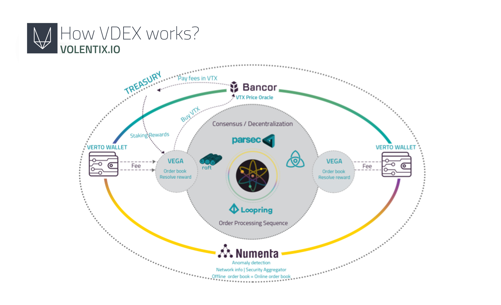
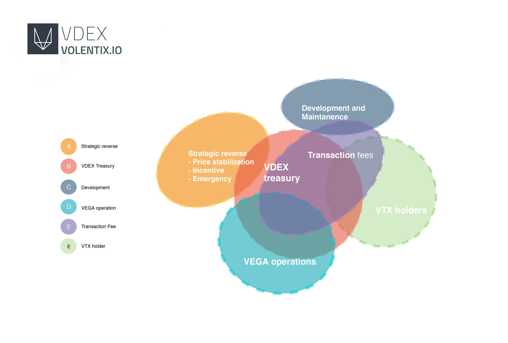
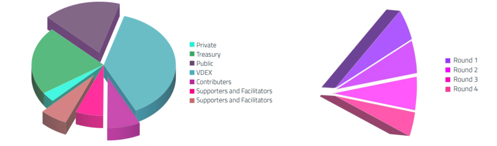

# הרשימה הלבנה של VOELNTIX VDEX

- גרסה: 0.1.4
- עודכן: 11-03-2019
- אתר: www.volentix.io

## 1. מבוא

Volentix מציג בתוכו את VDex, המשמש כ"חלפן כספים" למטבעות ונכסים ממוחשבים, המבוזר ומופץ עם דגש על חווית המשתמש/ת, יחד עם פיתוח הקהילה והמינהל. על-ידי גישה לשיטות טכנולוגיות מבוססות ותכנון סלקטיבי של פרוטוקולים חדשים עם עדיפות על אבטחה, מהירות, אימות, קלות השימוש, מידרגיות ותמיכה רב-רכושית, VDex נועד להקל על עסקאות בין עמית- לעמית בעזרת הרכבת תיק עבודות של יישומים מבוזרים הבנויים על חוזים חכמים של EOS.IO.

נקודת ההשקה של VDex מצפה להתאים לתנאי העיצוב של Volentix, ולאפשר זמינות לטכנולוגיות שעל גבי מערכת ההפעלה המבוזרת EOS.IO. בכוונתנו לבדוק את ההנחות שלנו באמצעות אב-טיפוס תוכנת EZEOS מותאמת אישית, שבנינו ועיצבנו עם כלי ממשק שורת הפקודה של EOS.IO. תוכנה זו נמצאת ב: https://github.com/Volentix/ezeos

## 2. VOLENTIX

מערכת Volentix תתקיים על גבי ארבעה עמודי תווך, מערך מאותחל של יישומים, הידועים בתור Venue, Verto, Vespucci ו VDex.

### 2.1 VENUE

Venue היא פלטפורמה דינאמית לקהילה, שמגייסת ומארגנת את חברי קהילתה בכדי להקל על ביזור הVTX- הנכס הדיגיטלי המקומי של Volentix, ועל מנת לעלות מודעות בנוגע ליוזמות Volentix.

לאחרונה הושקה בגירסת הבטא, Venue מאפשרת למשתמשים לקבל VTX בתמורה להשתתפות בפיתוח קהילתי, הגשת תיקונים לבאגים, וקבלת תגמולים. לוח תוצאות ומדדים חיים משקפים את השתתפות המשתמש. הקמפיין הראשוני הושק בפורום ה https://bitcointalk.org/ ביולי ה13, 2018. אנא בקר/י ב https://venue.volentix.io למידע נוסף.

### 2.2 VERTO

Verto מעוצב כארנק רב-מטבעות לשימוש עם ''חלפן הכספים'' המבוזר VDex, המכוון להקל על ניהול אישי ומקומי של מפתחות פרטיים וציבוריים בעסקאות בין עמית- לעמית, עם המטרה לחיסול סיכון של ספיגת אבידות כבדות המשויכות לכשלים טראומטיים של מפעילים מרכזיים. Verto משתמש במערכת של חוזים חכמים בכדי לשמר את המצב בין שני לקוחות המבצעים העברות, הפעולות הפשוטות ביותר שניתן להשיג עם חילופי מסחר ישירים.[1]

### 2.3 VESPUCCI

Vespucci משמש כמנוע לניתוח נתונים, נגיש באמצעות הממשק הידידותי למשתמש, עם נתוני שוק היסטוריים ונתונים בזמן אמת, כגון דירוגים של נכסים דיגיטליים ו''כריית דעות''. מטרתינו היא לחזק את המשתמשים עם כלים כדי לגרף להשווות נכסים דיגיטליים סחירים, בכדי לגשת ולנתח רשומות מסחר היסטוריות, ליזום טרנדים ודפוסים, וכמו כן לפקח ולהעריך את ההתפתחויות בתוכנת הקוד הפתוח. Vespucci מביא לך באופן בטוח ומקיף מידע שוק רלוונטי, על ידי מיון המידע המפוזר במקומות שונים כמו בלוקצ'יינים, אתרים, חדרי צ'אטים, ו''חלפני כספים''.

### 2.4 VDEX

עמוד התווך הרביעי של Volentix, ''חלפן הכספים VDex'', הינו פלטפורמת נכסים דיגיטלית המוצגת בפירוט ברשימה לבנה זו. עבור שימוש חלק ומאובטח, אנו מתכננים לשלב את הVDEX לתוך ארנק הVERTO האישי שלך, ובנוסף אל ממשק הVESPUCCI. אנו מצפים כי Vdex מסוגל יהיה לנהל העברות של VTX, בנוסף לשאר המגוון הרחב של נכסים דיגיטליים ובלוקצ'יינים קיימים מעת לעת ברחבי העולם. אנחנו מפתחים את הVenue כתוספת משלימה הנועדה בעיקר בשביל לתמרץ ולהניע יוזמות מקומיות המבוססות על VTX.

## 3. עיצוב מבני

#### מערכת הפעלה 3.0.1

אנו הערכנו מערכות הפעלה רבות כמועמדים לבנייה של '' חלפן הכספים VDex ''. למרות שאנו מכבדים את העבודה הנעשתה על-ידי מספר מנהיגים מייסדים של נכסים דיגיטליים וטכנולוגיות הבלוקצ'יין, כאשר בין האנשים הללו נכללת העבודה של EOS.IO כמערכת הפעלה- מן מסגרת בה אפשר לבנות יישומים מבוזרים, מסגרת זו הינה יוצאת דופן מבחינתנו ומשמשת לדעתנו כדוגמא. התוכנה מספקת חשבונות, אימות, מאגרי מידע, תקשורת אסינכרונית (מתאפשרת בזמנים שונים), ותזמון לאורך אשכולות המידע. רכיבים ופרוטוקולים כבר מובנים לתוך הפלטפורמה, ומצע משני יכול לשמש בכדי לספק את דרישות הVDex שלנו. בהתחלה, VDex יהנה מהתכונות הסטנדרטיות המוצעות עבור EOS.IO, כמו יצירה של חשבונות וארנקים והשחזור של מפתחות גנובים/אבודים, אך לאחר מכן אנו מתכננים להביא ליישום נהלים תקניים עבור יצירת ''חלפן כספים'' מבוזר דרך חוזי EOS וכלים נוספים. [2] פה תוכלו למצוא סיכום כלל העקרונות ושיטות הפעולה:

### פעולות תוכן חינמיות

רב הטכניקות המדרגיות המוצעות על ידי אתריום - Ethereum (Sharding, Raiden, Plasma, State channels) נהיות יותר יעילות, מקבילות ומעשיות תוך כדי הבטחת מהירות התקשורת בין בלוקצ'יינים ומניעת פגיעה במדרגיות. פעולת תוכן חינמית משלבת חישובים המסתמכים אך ורק על נתוני ההעברות, ולא על מעמד הבלוקצ'יין.

### המרה בינארית/JSON

חוזי EOS משלבים את הקריאות האנושית של JSON עם היעילות של מאפיינים בינאריים.

### מקבילות ואופטימיזציה

הפרדת האימות מהיישום מאפשרת העברה יותר מהירה ומגדילה את רוחב הפס. בלוקים של EOS.IO מיוצרים כל 500ms, על פי דיווחים.

### (Web assembly (WASM

Web Assembly מאפשר ביצועים גבוהים של יישומים רשתיים ומאבטח כל יישום בSandbox משלו, אשר דרך פונקציות אלו VDex יכול לקבל גישה רשתית, מגבלות בשמות ובקבצים של המערכת, ואכיפת הוצאות לפועל המבוססות על כללים.

### חוזים של ++Rust/C

נמצא כי שפת התכנות הידועה והפופולארית ''++C'' מותאמת עבור WASM. ל''++C'' ישנן ספריות ותמיכת איתור באגים עתורת ניסיון. קוד הבסיס של EOS משתמש בתבניות באופן ליבראלי, ו++C מאפשר את השימוש בתבניות ועומס יתר מנהלי על מנת להגדיר זמן ריצה ללא עלות, על האימות של יחידות. התוכנית מאתחלת מחדש למצב נקי בתחילתה של כל הודעה, יתרון משמעותי שמייעל את הניסוח של חוזים חכמים. מסגרת הWebAssembly דוחה באופן אוטומטי כל עסקה שפונה אל הזיכרון באופן לא מדוייק. במקרה והכרחי להקצות זיכרון דינאמי, משתמשים יכולים לעבור אל מצביעים חכמים כיוון שחוזי EOS.IO משתמשים ב C++14. זה ראוי לציין כי היישום הראשון בטכנולוגיית הגרף המיוכל (DAG) של PARSEC צפוי להיות בRust.

#### 3.0.2 הודעות מוגדרות בסכימה ומאגר נתונים

חוזי שירות מתוקננים על מנת לספק מידה בסיסית של יכולת פעולה הדדית בין מערכות שונות על-ידי הרמון מודלים של נתונים. אכן, עיקרון השירות של עיצוב חוזים סטנדרטיים תומך בביסוס חוזי שירות על מודלים סטנדרטיים של נתונים. ניתוח הנתונים נעשה בתוכנית שרות המלאי, על מנת לגלות את המסמכים העסקיים הנפוצים שאיתם מתבצעות החלפות בין שירותים שונים. מסמכים עסקיים אלו מעוצבים בצורה סטנדרטית. תבנית הסכימה הקנונית מפחיתה את הצורך ביישום הטרנספורמציה בדפוסי עיצוב של מודלי נתונים. [3]

#### 3.0.3 תקשורת בין חוזים

נתוני מידע מתחלקים בין חוזים באמצעות האורקל (oracle), אשר כפי שכתוב בתכני הבלוקצ'יינים והחוזים החכמים, הינו סוכן שמוצא ומאשר התרחשויות עולם אמיתי ומגיש את המידע הזה לבלוקצ'יין לשימושו בחוזים חכמים. [4] לכל צומת רשתית יהיה עותק זהה של נתונים אלה, לשימוש בחישוב של חוזים חכמים. במקום שהחוזה החכם יאסוף את הנתונים, האורקל דוחף את הנתונים על גבי הבלוקצ'יין. במקרה של כל בלוקצ'יין, רב הקריאה של הנתונים נעשית באמצעות סקירת ''מודלים'' בכדי לעקוב אחר הסטטוס של הבלוקצ'יין ועל מנת לבצע פעולות תגובה מסוימות.

#### 3.0.4 שרשורי צד

ב- EOS.IO, הנפקה של נכס דיגיטלי יוצרת שרשרת צד, דבר זה הוא מנגנון המתיר שימוש מאובטח של נכסים דיגיטליים מבלוקצ'יין אחד לאחר, ומאפשר את חזרתם לבלוקצ'יין המקורי. יעילות העיבוד מקודמת על-ידי יצירת שרשראות-צד מרובות. ערוץ תקשורת דמוי-TCP בין בלוקצ'יינים שונים המבצע אומדן הוכחות. For each shard (a unit of parallelizable execution in a cycle), a balanced merkle tree is constructed of these action commitments to generate a temporary shared merkle root; this is done for speed of parallel computation. The block header contains the root of a balanced merkle tree the leaves of which are the roots of these individual shard merkle trees. [2]

#### 3.0.5 הנזלה

ניתן להנזיל נכס דיגיטלי אם הוא נמכר בקלות או נרכש בשיטות מסחר רגילות ללא השפעה משמעותית לטווח קצר על מחיר השוק. על מנת להגיע למעמד סטטוס שכזה, באופן מסורתי, כל נכס סחיר חייב לעלות מעל לסף נפח המסחר בכדי להשיג יציבות. Specifically, we anticipate adopting the following methodologies: Loopring protocol with the use of EOS.IO contracts acting as nodes.[5] Bancor algorithm used to bring stability to the digital asset.[6] Toggles between these protocols and HTLC (atomic swaps) according to Vespucci analyses on the VDex network.

#### 3.0.6 חוזי זמן נעולים (החלפות אטומיות)

חוזה זמן נעול (HTLC)[1] חוזה חכם (סוג של תשלום בו שני משתמשים מסכימים להסדר כספי, שם צד אחד ישלם לצד השני כמות מסוימת של מטבע מבוזר), המאפשר את יישומן של העברות מוגבלות-זמן (העברות ''נעולות זמן'', בהן הצד המקבל מותנה בכמות מסוימת של זמן עד לאישור התשלום, למקרה ותהיה חריגה מהזמן המוקצה, הכסף יוחזר לשולח). למשתמשים תוצע תקופת נעילה משתנה בעבור העברותיהם, עם הנחה על עלויות ההעברות בתמורה לבחירה בתקופת נעילה ארוכה יותר.

### 3.1 טופולוגיית רשת

#### 3.1.1 צמתי רשת

צמתי רשת הינם נקודות הקצה של '' חלפן הכספים VDex ''. התפקידים שלהם:

1. משמשים כקישור לVDex דרך ארנק הVerto.

2. איסוף מידע בספר ההזמנות.

3. ארגון ספר הזמנות.

4. ניהול ביטולי הזמנות.

5. מקצים פסקי-זמן בעבור פרוטקול הRAFT.

6. מיישמים חוזים למען הזמנות שמולאו.

צמתי רשת מרוויחים חלק מדמי האגרה בעבור כל העברה. אם המשתמש/ת מחזיק/ה בכמות הכספים הנדרשת, וברשותו/ה רישומים אמינים המעידים על כך, ארנק ה Verto שלו/ה יכול לשמש כצומת רשתי.

#### 3.1.2 צוברים

צוברי הVDex הם שרתים של Volentix המיועדים עבור מטרות אבטחה והדמיה. One of their functions is to pull logs and order book data from nodes into sparse distributed representations for hierarchical temporal memory as intrusion [7] analysis for detecting anomalies in the system. הצוברים כמו כן יארחו רכיבים אחרים כגון לדג'רים ב''metachain'' ומגרדי הבלוקצ'יין.

#### 3.1.3 השהיה

לEOS.IO השהיה קצרה בעת אישור הבלוק (0.5 שניות).[5] רמה זו של השהיה יכולה להישמר בעסקאות עם בלוקצ'יינים אחרים, כל עוד זמן ההשהיה דומה ביניהם. כעיקרון החליפין פועל אך ורק באותה מהירות כשם השרשרת בתוך המשוואה. ידוע, כי למשל, לבלוק של ביטקוין נדרש כעשר דקות לעבד. קבלה של עסקה נעולה אינו אומר שהעסקה מאושרת; זה מוודא כי צומת רשתי אישר את העסקה ללא תקלה, אף על פי שיש סיכוי גבוה לאישורם של מנפיקי בלוקים אחרים.

### 3.2 ספר הזמנות

ספר ההזמנות הינו רשימה של כל הזמנות הקניה ומכירה מרשומות הVDex של משתמשים מעוניינים. מנוע ההתאמה משתמש בספר ההזמנות על מנת לקבוע אילו הזמנות ימולאו. פרוטוקול הלופרינג (Loopring) מאפשר עיצוב אישי של מבנה נתוני המידע בספר ההזמנות.[5] מיכלים שסופקו על-ידי EOS.IO יכולים לשמש בעבור ביצוע מיטבי.[8]

#### 3.2.1 מבנה נתוני

Using the Loopring Protocol FIFO (first-in first-out) circular buffer, nodes can design their order books to display and match a user’s order. שיטה זו הולכת אחרי מודול OTC, שם מגבלות ההזמנות מוגדרות בהתבסס על מחיר בלבד.[5]

Referencing the EOS.IO persistence API, the order book is able to take advantage of the powerful multi-index container shared among nodes through the same EOS.IO account.

#### 3.2.2 ספר הזמנות על-שרשורי

ספר הזמנות על-שרשורי הוא רשימה תיעודית של כל הצעה המתגוררת בארנק (צומת רשתי) הנבחר לבסס את ספר ההזמנות הכללי. הוא שוכן במאגר נתונים תמידי, על גבי כל צומת רשתי שמנוי לאותו חשבון כשם צמתי הרשת האחרים.

#### 3.2.3 ספר הזמנות תחת-שרשורי

Residing on the aggregator, offline order books serve for simulator and security purposes.

#### 3.2.4 Decentralization process of order book settlement

For decentralization purposes, nodes will take turns to settle the order book. The settling node must be designated by the protocol and all order book entries from all nodes must be available to the settling nodes. We believe the RAFT[9] and PARSEC[10] consensus mechanisms offer effective solutions. RAFT is a well-established algorithm and is easy to implement.[7] PARSEC is more recent and more efficient, using Directed Acyclic Graph (DAG) technology and eliminating the need for copying logs.

### 3.3 ORDER SETTLEMENT

Order settlement contains familiar elements of conventional financial market transactions. Utilizing FIFO technology to design the order book, VDex intends to check order, inventory, and fill rate, as well as limit orders and cancellations. 

### 3.4 VTX

#### 3.4.1 VTX Issuance and Use

VTX is the native digital asset to be issued and used on the VDex decentralized exchange. We currently plan to use an eosio.token contract from the EOS.IO framework to issue 2.1 billion EOS.IO-compliant VTX tokens with a supply of 1.3 billion. VTX will have a diverse array of uses, for example:

To reward participants in the consensus process and in Venue campaigns.

To pay and redistribute transaction fees on the VDex exchange.

To submit and vote on proposals to the Volentix ecosystem, using the voting rights allocated to VTX holders.

To stake support for reviewing proposals and implementing projects.

To incentivize users to participate in order book settlement by becoming nodes via their Verto wallets.

To incentivize users to lock funds in for >24 hours by HTLC time-bound transactions.

#### 3.4.2 VTX Allocation

A digital assets ecosystem requires an array of certain fundamental human constituents who shepherd the project forward.[11] It is essential to compensate those individuals for their participation. Subject to adjustment, Volentix currently anticipates the following allocations:

1. Contributors. 12%. An array of individuals, akin to founders, who contribute insights, time and talent, though often work without early compensation.

2. Supporters.

Phase 1. 5%. Early passive seed funders.

Phase 2. 28%. Funders via qualified private pre-sales and possible public sale.

3. Facilitators. (Advisors, Developers, Promoters, Custodians). Note that requirements for assistance from the sub-categories in this category may differ significantly before and after the project receives substantial funding support, but certain individuals may serve during both phases.

Phase 1. 10%.

Phase 2. 10%.

4. Decentralized treasury. 35%. Community members incentivized and rewarded for participation in progressive development of a decentralized autonomous organization (DAO). A decentralized treasury is anticipated to be administered by smart contracts and community consensus. 

#### 3.4.3 VTX Distribution

In light of market conditions at the time of this writing, Volentix is considering timing, means, and terms and conditions of VTX distribution as a function of private pre-sales and possible public sale. Please monitor our website for updates.

### 3.5 EOS.IO PLATFORM DEPLOYMENT

The following considerations are relevant to our deploying the VDex exchange on the EOS.IO platform:

Deploying a contract has a cost but is free to use.

Developers stake EOS.IO-compliant tokens to deploy a smart contract. After the contract is deployed, the locked tokens are returned.

Decentralized applications allocate memory, CPU, bandwidth, and other resources to their contracts.

Multiple messages and multiple accounts can be assigned to the same thread.

### 3.6 BLOCKCHAIN INTERACTION

#### 3.6.1 Inter-Blockchain Communication

EOS.IO is designed to make Inter-Blockchain Communication (IBC) proofs lightweight. For chains with insufficient capacity for processing the IBC proofs and establishing validity, there is an option to default to trusted oracles/escrows. With an EOS.IO-based smart contract, a trusted multi-signature wallet holding the asset in escrow can be used to persuade the signing/publishing of the transaction based on IBC proofs from the originating chain.

#### 3.6.2 Multi-Blockchain Information

Comprehensible multi-blockchain information can be obtained by aggregating blockchain timelines in parallel order (with variance in the frequency of change of state). This system can trigger multi-chain load balancers, transfer states, draw data outputs from smart contracts, and foreign blockchain transaction execution. Relative block distance, relative global state, and timestamped events are recorded on a global ledger to optimize and confirm transactions before they actually happen on the native chain. This approach could also be used to determine block production coincidence between chains to access greater liquidity.[12]

### 3.7 SECURITY CONCERNS

To shake out certain assumptions, we intend to commence security testing following the prototyping phase. Security concerns are of paramount importance to users and must be addressed. Threats include, for example, an attacker executing malicious code within a transaction or manipulating the order of transactions or the timestamps of blocks. In the following sections, we address certain security measures and specific security threats and remedies.

### 3.8 SECURITY MEASURES

#### 3.8.1 Contract security

Retain vast majority of funds in a time-delayed, multi-signature-controlled account.

Use multi-signatures on a hot wallet with several independent processes/servers double-checking all withdrawals, with the concomitant benefit of creating a trusted list of accounts.

Deploy a custom contract that allows withdrawals only to accounts verified by KYC/AML.

Deploy a custom contract that accepts only deposits of known assets from accounts verified by KYC/AML.

Deploy a custom contract that requires a mandatory 24-hour waiting period for all withdrawals.

Utilize contracts with hardware wallets for all signing, including for automated withdrawals.

Upgrade broken contracts.

Include ability to pause the functionality of a contract.

Include ability to delay an action of a contract.

#### 3.8.2 Auditing rogue processes

The advanced anomaly detection algorithms provided by Numenta’s Nupic library will require less voluminous training data sets than conventional AI systems.

#### 3.8.3 Randomization

True randomisation of address space layout, route or utilizing varying lengths of timeouts as in the RAFT protocol can complexify systems enough to enhance resilience and further secure systems against a side-channel attack or front running.

#### 3.8.4 Log inspection

Parsec does not rely on logs for the determination of consensus. On the other hand, RAFT will require this. In any case, Validator nodes will be designed to require minimal information To determine consensus as to minimize the transaction process time.

#### 3.8.5 Transaction as Proof of Stake (TaPoS)

This mechanism prevents the replay of a transaction on forks that do not include the referenced block. Signals the network that a particular user and stake are on a specific fork.

### 3.9 Security threats and remedies

#### 3.9.1 Double spend

A double spend is an attack in which a particular cryptocurrency stake is spent in more than one transaction.

A race attack occurs when two conflicting transactions are sent in rapid succession into the network.

A Finney attack pre-mines one transaction into a block and spends the same tokens before releasing the block to invalidate that transaction.

A 51% attack can be mounted by anyone owning >50% of the total computing power of a network. A majority ownership position permits reversal of any transaction and allows total control of selection of transactions appearing in blocks. EOS.IO, Loopring, and RAFT appear to prevent this problem. If a block producer takes an unreasonable amount of runtime or is not sufficiently profitable, then the process is blacklisted.[5]

#### 3.9.2 Front running

A front runner steals one or more orders from a pending order book settlement transaction. Both EOS.IO and Loopring offer remedies in which keys are protected because they are not part of the on-chain transaction, and therefore remain unknown to parties other than the owner. Only the order book settling node is possessed of the sensitive information, and each node uses a different solution for resolving the order books, introducing yet another level of complexity to promote security.

#### 3.9.3 Forged identities

Malicious users create forged identities to send a large number of small orders to attack Loopring nodes. However, most of these orders will be rejected for not yielding satisfying profit when matched.

#### 3.9.4 Insufficient Balance

Malicious users sign and spread orders the value of which is non-zero but the address of which has a zero balance. Nodes monitor actual balances, update these order states accordingly, and then discard them.

#### 3.9.5 Timing attack

Timing attacks are a class of cryptographic attacks through which a third-party observer can deduce the content of encrypted data by recording and analyzing the time taken to execute cryptographic algorithms. The RAFT algorithm prevents timing attacks by using randomness of timeouts.

### 3.10 USER EXPERIENCE

Our focus on user experience is primary. We wish to make VTX and the four pillars of Volentix -- Venue, Verto, Vespucci, and VDex -- easily accessible to and useable by all those who wish to join our community. We expect the experience continually to be educational as well, with templates and simulators to support a superior UX/UI relationship.

### 3.11 TRUE DECENTRALIZATION

EOS.IO is an open-source, scalable infrastructure for decentralized applications. Its goal is a fair and transparent block producer (BP) election process utilizing a democratic delegated proof of stake (DPoS) consensus. Particularly as such a system just begins to proliferate, there will be glitches. Therefore, some degree of retained centralization is inevitable and necessary. But our guiding philosophy is one of decentralization, and our ongoing efforts are targeted to promoting a reduction in dependence on central authority.

For example, initially we plan to erect a system for electing nodes (when solving order books) that will not use a shared central clock or DPoS but instead will be based either on random timeouts for the determination of leaders in an election (RAFT) or on Directed Acyclic Graph (DAG) in the PARSEC protocol.

### 3.12 SYSTEM RECOVERY

The RAFT and PARSEC protocols provide a robust system for recovery in the case of node failure. Security measures are also provided for trading between and among native blockchains. If a chain defies identification, the system defaults to the next block or a short time lock.

### 3.13 EVOLVING ARCHITECTURE

Daily announcements of fresh code developments impacting on use of digital assets reveal the tremendous benefit of the open-source code philosophy. We at Volentix recognize we are the beneficiaries of the enormous financial resources dedicated by many early movers to developing digital assets applications over the past decade. We now have an opportunity to take the next step by creating VDex, a decentralized exchange for the next generation of digital assets transactions.

## 4. CONCLUDING THOUGHTS

All of us at Volentix are dedicating our work and insights to developing a program premised on empowerment and independence. If you are of a mind to join us, in whatever capacity, then please do so and please become educated on the topics contained in this white paper and additional Volentix publications as we share them with our community.

## 5. TIMELINE

Please monitor our website and social media for updates and other important announcements. Thank you very much for your attention and interest.

## DISCLAIMER

This white paper was prepared, and is presented, for information purposes only. The information presented does not purport to be comprehensive. The information is subject to change in whole or in part at any time without notice. Volentix Labs reserves the right to amend, replace, remove, or delete any and all information at the sole and exclusive discretion of Volentix. Volentix Labs makes no representation or warranty, expressed or implied, concerning the accuracy or completeness of the information and expressly disclaims any and all liability of any and all kinds whatsoever for the information contained or not contained. Volentix Labs requests each and every reader to read the information fully and carefully, and to undertake independent investigation and analysis of the information, and to seek and obtain professional advice for purposes of evaluating the information. To the knowledge of Volentix Labs, no regulatory agency, government, or other third-party enforcement entity has reviewed, evaluated, or approved any part or all of the information. This information is not an offer or solicitation of any kind whatsoever and does not form the basis for any contract or commitment of any kind whatsoever. Any statement considered to be forward-looking is purely a matter of opinion, and no viewer should rely on any such statement or on any part or all of the information in any way whatsoever.

## FOOTNOTES

1. K. Kurokawa, Atomic cross chain transfer, an overview, (2015).

2. EOS.IO, Eos.io technical white paper v2, (2018).

3. T. Earl, Soa principles of service design, (2016).

4. blockchainhub.net, blockchain-oracles, (2017).

5. F. Zhou, Wang, Loopring: A decentralized token exchange protocol, (2018).

6. G. B. Eyal Hertzog, Guy Benartzi, Bancor protocol: Continuous liquidity for cryptographic tokens through their smart contracts, (2018).

7. L. Lamport, The part time parliament, (1998).

8. D. Larimer, eosio.boot telegram chat, (2018).

9. J. O. Diego Ongaro, In search of an understandable consensus algorithm, (2018).

10. F. H. Q. M. S. S. Pierre Chevalier, Bart lomiej KamiÂťnski, Protocol for asynchronous, reliable, secure and efficient consensus (parsec), (2018).

11. Dane Keller Rutledge, Fundamental Human Constituents of a Digital Assets Ecosystem (DAE). (2018).

12. BlockColliderTeam, Block collider white paper, (2018).

## SUPPLEMENTAL REFERENCES

Aelf, A multi-chain parallel computing blockchain framework, (2018).

ARK, A platform for consumer adoption, (2018).

V. Buterin, Ethereum: a next generation smart contract and decentralized application platform, (2013).

S. Cormier, A machine based societal model for curbing citizen cynicism, (2017).

M. Duncan, Quale, Halo platform, (2018).

S. D. K. M. T. S. H. Garcia-Molina, The eigentrust algorithm for reputation management in p2p networks, (2018).

M. R. Garrick Hileman, Global cryptocurrency benchmarking study, (2017).

Komodo, An advanced blockchain technology, focused on freedom, (2018).

Q. Liquid, Providing liquidity to the non-liquid crypto economy, (2018).

S. R. M.P.M-S, Aniket Kate Matteo Maffei, Concurrency and privacy with payment-channel networks, (2017).

SingularityNET, A decentralized, open market and inter-network for ais, (2018).

M. M. Timo Hanke and D. Williams, Dfinity technology overview series consensus system, (2018).

A. B. Will Warren, 0x: An open protocol for decentralized exchange on the ethereum blockchain, (2017).

G. Wood, Ethereum: A secure decentralised generalised transaction ledger.ethereum project yellow paper, (2014).

Dane Keller Rutledge, Creating a Comprehensive Digital Assets Ecosystem (DAE), (2018).

## END OF PAPER