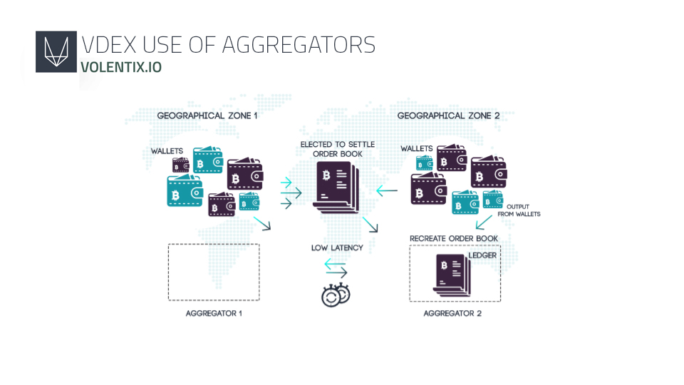

# VOLENTIX VDEX TANITIM BELGESİ

- Sürüm: 0.1.4
- Güncellendi: 11-03-2019
- Web sitesi: www.volentix.io

## 1. GİRİŞ

Volentix, kullanıcı deneyimi ve toplum gelişimi ve yönetişimi üzerinde durularak dağıtılmış, merkezi olmayan bir dijital varlık değişimi olarak tasarlanan VDex'i tanıtıyor. VDex, yerleşik teknolojilere erişerek ve güvenlik konusunda öncelikli seçici yeni protokoller, hız, kimlik doğrulama, kullanım kolaylığı, ölçeklenebilirlik ve çoklu varlık desteği konularında öncelikli seçici yeni protokoller planlayarak, EOS.IO akıllı sözleşmelerine dayanan bir merkezi olmayan uygulama portföyü oluşturarak eşler arası işlemleri kolaylaştırmayı amaçlamaktadır.

VDex başlangıç noktası, Volentix'in tasarım gereksinimlerini EOS.IO merkezi olmayan işletim sisteminde bulunan mevcut teknolojilerle eşleştirmeyi öngörüyor. Varsayımlarımızı, EOS.IO'nun cleos komut satırı araçları ile oluşturup özelleştirdiğimiz özel EZEOS yazılımı aracılığıyla prototipleyerek test etmeyi amaçlıyoruz. Bu yazılım şurada bulunur: https://github.com/Volentix/ezeos

## 2. VOLENTIX

Volentix ekosistemi, özellikle Venue, Verto, Vespucci ve VDex olarak bilinen bir dizi uygulama başlatan dört sütunun üzerinde olacaktır.

### 2.1 VENUE

Venue, Volentix ekosisteminin yerel dijital varlığı olan VTX'in dağıtımını kolaylaştırmak ve Volentix girişimlerinin farkındalığını arttırmak için Volentix topluluğunun üyelerini işe alan ve hizalayan dinamik bir topluluk platformu olarak planlanmıştır.

Beta testlerinde yeni piyasaya sürülen Venue, kullanıcıların, örneğin adanmış topluluklar geliştirmek, hata düzeltmeleri göndermek ve ikramiye talep etmek karşılığında VTX almalarına olanak tanıyor. Liderler sıralaması ve canlı ölçümler kullanıcının katılımını yansıtır. İlk imza kampanyası, 13 Temmuz 2018'de https://bitcointalk.org/ forumunda başlatıldı. Lütfen daha fazla bilgi için https://venue.volentix.io ziyaret edin.

### 2.2 VERTO

Verto, VDex merkezi olmayan borsası ile kullanılmak üzere çoklu para birimi cüzdan olarak inşa ediliyor ve merkezi operatörlerin travmatik başarısızlıklarıyla ilişkili yıkıcı kayıpların risklerini ortadan kaldırmak için eşler arası işlemlerde özel ve halka açık anahtarlarının kişisel velayetini ve yerel yönetimini kolaylaştırmayı amaçlamaktadır. Verto, iki ticaret müşterisi arasındaki durumu korumak için akıllı sözleşmeler sistemini kullanmayı planlıyor, en basit işlemler atomik takaslarla gerçekleştiriliyor.[1]

### 2.3 VESPUCCI

Vespucci, dijital varlık derecelendirmeleri ve duyarlılık analizi gibi gerçek zamanlı ve tarihsel piyasa verilerinin hazine askerleri ile kullanıcı dostu bir arayüzle erişilebilen bir analitik motoru olarak öngörülmektedir. Kullanıcıları, takas edilebilir dijital varlıkları grafiklemek ve karşılaştırmak, geçmiş alım satım kayıtlarına erişmek ve ayrıştırmak, trendleri ve kalıpları çizmek ve açık kaynaklı yazılım gelişmelerini izlemek ve değerlendirmek için araçlarla güçlendirmek istiyoruz. Vespucci, şu anda birçok farklı blok zincirleri, web siteleri, sohbet odaları ve borsalara dağılmış olan bilgileri bir araya getirerek parmaklarınızın ucunda güvenli ve piyasa ile ilgili kapsamlı verileri bulmaya çalışıyor.

### 2.4 VDEX

Volentix'in dördüncü sütunu, VDex borsası tanıtım belgesinde ayrıntılı olarak tanıtılan alınıp satılabilir dijital varlık platformudur. Sorunsuz ve güvenli bir kullanım için VDex'i kendi kişisel Verto cüzdanınız ve Vespucci arayüzünüzle entegre etmeyi planlıyoruz. Hem VDex'in hem de VTX’in dünya genelinde zaman zaman mevcut olan çok sayıda dijital varlık ve blok zincirini içeren işlemleri yönetebilmesini bekliyoruz. VTX tabanlı yerel girişimleri teşvik etmek ve yönlendirmek için öncelikle bir tamamlayıcı yardımcı olarak Venue'yü geliştiriyoruz.

## 3. MİMARİ

#### 3.0.1 İşletim sistemi

VDex borsasının altyapısı için çeşitli işletim sistemlerini aday olarak değerlendirdik. Dijital varlıklar ve blok zinciri teknolojisinde, yerleşik liderlerin bir kısmının yaptığı çalışmaları onurlandırmamıza rağmen, bu öncüler arasında EOS.IO'nun merkezi olmayan uygulamaların işletim sistemi benzeri bir çerçeve olarak çalışması bizim görüşümüze göre örnek olarak öne çıkmaktadır. Yazılım, hesaplar, kimlik doğrulama, veritabanları, zaman uyumsuz iletişim ve kümeler arasında zamanlamayı sağlar. Bileşenler ve protokoller platforma zaten yerleştirilmiştir ve VDex gereksinimlerimizi karşılamak için bir alt küme kullanılabilir. VDex başlangıçta hesap ve cüzdan oluşturma ve çalınan anahtarların kurtarılması gibi EOS.IO tarafından sunulan standart özelliklerden faydalanacak ancak daha sonra EOS sözleşmeleri ve diğer araçlar aracılığıyla merkezi olmayan bir borsanın oluşturulması için protokoller uygulamayı planlıyoruz.[2] İşte teşvik edici metodojilerin bir özeti:

### Ücretsiz İçerik İşlemleri

Ethereum (Sharding, Raiden, Plazma, Devlet Kanalları) tarafından önerilen ölçeklenebilirlik tekniklerinin çoğu daha verimli, paralelleştirilebilir ve pratik olarak aynı zamanda blok zincirleri arası hızlı iletişim ve bozulmamış ölçeklenebilirlik sağlarken pratik hale gelir. Ücretsiz Bir Bağlam Hareketi, blok zinciri durumuna değil, yalnızca işlem verilerine dayanan hesaplamaları içerir.

### Binary/JSON dönüştürme

EOS sözleşmeleri, JSON'un insan tarafından okunabilirliğini ikili verimlilik ile birleştiriyor.

### Paralelleştirme ve optimizasyon

Kimlik doğrulamasını uygulamadan ayırmak daha hızlı işlem süresi sağlar ve bant genişliğini artırır. EOS.IO bloklarının her 500ms'de bir üretildiği bildiriliyor.

### Web Meclisi(WASM)

Web Meclisi, yüksek performanslı Web uygulamalarını mümkün kılar ve aynı zamanda VDex'in ağ erişimi, dosya sistemi ad kısıtlamaları ve zorunlu kural-tabanlı yürütme sağladığı işlevsellikler sayesinde her uygulamayı kendi sanal alanında güvence altına alır.

### Rust/C++ sözleşmeleri

İyi bilinen ve popüler programlama dili C++ WASM için oldukça uygun görünüyor. C++ son derece olgun hata ayıklama desteğine ve kütüphanelerine sahiptir. EOS kod temeli özgürce şablonları kullanır ve C++ birimlerin çalışma zamanı maliyetsiz doğrulamasını tanımlamak için şablonların ve operatörün aşırı yüklenmesinin kullanılmasına izin verir. Program her mesajın başında durumu temizlemek için yeniden başlatıldı, akıllı sözleşmelerin formülasyonunu kolaylaştıran belirgin bir avantaj. WebAssembly çerçevesi hafızada hatalı adresleme yapan herhangi bir işlemi otomatik olarak reddeder. Dinamik bellek tahsisi gerektiğinde, EOS.IO sözleşmeleri C++14 kullandığı için kullanıcılar akıllı göstergelere gidebilir. PARSEC Yönlendirilmiş Asiklik Grafik (DAG) teknolojisinin dikkat çekici ilk uygulamasının Rust'ta olması beklenmektedir.

#### 3.0.2 Şema tanımlı mesajlar ve veritabanı

Hizmet sözleşmeleri, veri modellerinin uyumlaştırılması ile farklı sistemler içinde ve birlikte çalışabilirlik arasında temel bir ölçümü sağlamak için standartlaştırılmıştır. Gerçekten de, Standart Servis Sözleşmesi tasarım ilkesi servis sözleşmelerinin standartlaştırılmış veri modellerine dayanmasını savunuyor. Servisler arasında değiş tokuş edilen yaygın iş belgelerini bulmak için servis envanter planı üzerinde analiz yapılır. Bu iş belgeleri daha sonra standartlaştırılmış bir şekilde modellenmiştir. Kanonik Şema deseni, veri modeli dönüşüm tasarım modelinin uygulama ihtiyacını azaltır. [3]

#### 3.0.3 Sözleşmeler-Arası İletişim

Veriler bir uzman yoluyla sözleşmeler arasında paylaşılır, bu, "Blok zincirleri ve akıllı sözleşmeler bağlamında, gerçek dünyadaki olayları bulan ve doğrulayan ve bu bilgileri akıllı sözleşmeler tarafından kullanılacak bir blok zincirine ileten bir temsilcidir." [4] Her düğüm akıllı sözleşme hesaplamasında kullanmak için bu verilerin özdeş bir kopyasına sahip olacaktır. Verileri çekmek için çalışan akıllı sözleşmenin yanı sıra, bunun yerine uzman, verileri blok zincirine iter. Bir blok zinciri örneğinde, çoğu verinin okunması, blok zinciri durumunu izlemek ve belirli duyarlı eylemleri gerçekleştirmek için "modeller" seçilerek yapılır.

#### 3.0.4 Yan zincirler

EOS.IO'da, dijital bir varlığın verilmesi bir yan zincir oluşturur, bu, bir blok zincirinden gelen dijital varlıkların ayrı bir blok zincirinde güvenli bir şekilde kullanılmasını ve daha sonra orijinal blok zincirine geri taşınmasını sağlayan yeni bir mekanizmadır. Çoklu yan zincir oluşturularak işleme verimliliğini arttırır. Farklı blok zincirleri arasındaki TCP benzeri bir iletişim kanalı kanıtları değerlendirir. Her bir kırılma için (bir devirde paralelleştirilebilir bir uygulama birimi), geçici bir ortak merkle kökü oluşturmak için bu aksiyon taahhütlerinden dengeli bir merkle ağacı oluşturulur; bu paralel hesaplama hızı için yapılır. Blok başlığı, yaprakları tek tek kırma bireysel ağaçlarının kökleri olan dengeli bir merkle ağacının kökünü içerir. [2]

#### 3.0.5 Likidite

Dijital bir varlık, geçerli piyasa fiyatlarına kısa vadeli bir etkisi olmadan, normal işlem hacimlerinde kolayca satılır veya satın alınırsa likit olur. Böyle bir statüye ulaşmak için geleneksel olarak, herhangi bir ticari varlığın istikrarı desteklemek için yeterli bir işlem hacmi eşiğini aşması gerekir. Özellikle, aşağıdaki metodolojilerin benimsenmesini bekliyoruz: EOS.IO kullanımı ile döngü protokolü, düğüm görevi görür.[5] Dijital varlığa istikrar getirmek için kullanılan Bancor algoritması.[6] VDex ağındaki Vespucci analizlerine göre bu protokoller ve HTLC (atomik takaslar) arasında geçiş yaparlar.

#### 3.0.6 Şifreli Zaman Aşımı Sözleşmeleri (Atomik Takaslar)

Şifrelenmiş Bir Zaman Kilidi Sözleşmesi (HTLC)[1] zamana bağlı işlemlerin uygulanmasını sağlayan akıllı bir sözleşmedir. Kullanıcılara işlemlerinde değişken bir kilitlenme süresi sunulur, daha uzun bir kilitlenme süresi seçmek için işlem ücretlerinde indirim yapılır.

### 3.1 AĞ TOPOLOJİSİ

#### 3.1.1 Düğümler

Düğümler VDex borsasının son noktalarıdır. İşlevleri:

1. Verto cüzdanı vasıtasıyla VDex'e portallar olarak rol yapın.

2. Emir kitabı bilgilerini birleştir.

3. Emir kitabını kapat.

4. Emir iptalini yönet.

5. RAFT protokolü için zaman aşımlarını atayın.

6. Doldurulan emirler için sözleşmeleri başlat.

Düğümler her işlem için ücretin bir kısmını kazanır. Eğer bir kullanıcının yeterli fonu varsa ve iyi bir sicile sahipse, Verto cüzdanı bir düğüm gibi davranabilir.

#### 3.1.2 Toplayıcılar

VDex toplayıcıları simülatör ve güvenlik amacıyla Volentix sunucularına verilmiştir. İşlevlerinden biri, günlükleri almak ve kitap verilerini düğümlerden sistemdeki anormallikleri tespit etmek için izinsiz giriş [7] analizi olarak hiyerarşik zamansal bellek için seyrek dağıtılmış gösterimlere almaktır. Toplayıcılar ayrıca metachain defterleri ve blok zinciri sıyırıcıları gibi diğer bileşenlere de ev sahipliği yapacaktır.

#### 3.1.3 Gecikme

EOS.IO düşük gecikmeli blok onayına sahip (0.5 saniye).[5] Bu gecikme derecesi, bu zincirler benzer gecikmeyi kabul ettiğinde, diğer blok zincirleriyle yapılan işlemlerde korunabilir. Fakat temelde işlem, denklemdeki daha az hızlı zincir kadar hızlıdır. Örneğin bir Bitcoin bloğunun işlem için yaklaşık on dakika gerektirdiği iyi bilinmektedir. Bir işlem karması almak, işlemin onaylandığı anlamına gelmez; bu, yalnızca bir düğümün işlemi hatasız olarak kabul ettiği anlamına gelir ancak diğer blok üreticilerinin bunu kabul etmesi genellikle yüksek bir ihtimaldir.

### 3.2 EMİR KİTABI

Emir defteri, ilgili kullanıcılardan VDex kayıtları al ve sat emirlerinin listesidir. Eşleşen bir motor, hangi emirlerin yerine getirilebileceğini belirlemek için bir emir defteri kullanır. Döngü protokolü, emir defteri veri yapısını özelleştirmeye izin verir.[5] EOS.IO tarafından sağlanan kaplar optimum performans için kullanılabilir.[8]

#### 3.2.1 Veri yapıları

Döngü Protokolü FIFO (ilk giren ilk çıkan) dairesel arabelleği kullanan düğümler, emir defterlerini bir kullanıcının emrini görüntülemek ve eşleştirmek için tasarlayabilir. Bu yöntem, limit fiyatlarının yalnızca emirilerine göre konumlandırıldığı OTC modelini izler.[5]

EOS.IO sürekli API'ına atıfta bulunarak, sipariş kitabı, aynı EOS.IO hesabı üzerinden düğümler arasında paylaşılan güçlü çok dizinli kapsayıcıdan yararlanabilir.

#### 3.2.2 Açık-Zincir emir kitabı

Açık zincirde bir emir defteri, emir defterini düzenlemek için seçilen cüzdan (düğüm) üzerinde bulunan tekliflerin bir kaydıdır. Diğer tüm düğümlerle aynı hesaba abone olan her düğümde kalıcı bir veritabanında bulunur.

#### 3.2.3 Kapalı-Zincir emir kitabı

Toplayıcıya dayanarak, çevrimdışı emir kitapları servisi simülatör ve güvenlik amaçlıdır.

#### 3.2.4 Emir defteri anlaşmasının merkezi olmayan süreci

Merkezi olmayan amaçlar için düğümler, emir defterine yerleşmek için sırayla alacaklardır. Yerleşme düğümü protokol tarafından belirtilmeli ve tüm düğümlerden gelen tüm emir defteri girişleri yerleşme düğümleri için erişilebilir olmalıdır. RAFT[9] ve PARSEC[10] fikir birliği mekanizmalarının etkili çözümler sunduğuna inanıyoruz. RAFT iyi kurulmuş bir algoritmadır ve uygulaması kolaydır.[7] PARSEC, Yönlendirilmiş Asiklik Grafik (DAG) teknolojisini kullanarak ve günlükleri kopyalama ihtiyacını ortadan kaldırarak daha yeni ve daha verimlidir.

### 3.3 EMİR VERME

Emir verme, geleneksel finansal piyasa işlemlerinin bilinen öğelerini içerir. Emir defterini tasarlamak için FIFO teknolojisini kullanan VDex, emirleri, stokları ve doldurma oranlarını kontrol etmenin yanı sıra limitli emirler ve iptalleri de sınırlamayı amaçlamaktadır. 

### 3.4 VTX

#### 3.4.1 VTX Çıkarma ve Kullanımı

VTX, VDex merkezi olmayan borsasında çıkarılacak ve kullanılacak yerel dijital varlıktır. Şu anda EOS.IO çerçevesinden 2.1 milyar EOS.IO uyumlu VTX tokenleri çıkması için 1.3 milyar tedarikle birlikte bir eosio.token sözleşmesini kullanmayı planlıyoruz. VTX, çeşitli kullanım alanlarına sahip olacaktır, örneğin:

Fikir birliği sürecinde ve Venue kampanyalarında katılımcıları ödüllendirmek için.

VDex borsasında işlem ücretlerini ödemek ve yeniden dağıtmak için.

To submit and vote on proposals to the Volentix ecosystem, using the voting rights allocated to VTX holders.

To stake support for reviewing proposals and implementing projects.

To incentivize users to participate in order book settlement by becoming nodes via their Verto wallets.

HTLC'nin zamana bağlı işlemleriyle kullanıcıları, >24 saat boyunca fonları kilitlemeye teşvik etmek için.

#### 3.4.2 VTX Tahsisi

Dijital varlıklar ekosistemi, projeyi öne süren belli başlı temel insan bileşenlerini gerektirir.[11] Bu bireylere, katılımlarını telafi etmek esastır. Ayarlamaya tabi olarak, Volentix şu anda aşağıdaki tahsisleri öngörmektedir:

1. Katkıda Bulunanlar. %12. Kuruculara benzer, içgörülere, zamana ve yeteneğe katkıda bulunan bir dizi insan, genellikle erken tazminat olmadan çalışır.

2. Destekçiler.

1. Aşama %5. Erken pasif tohum fon sağlayıcıları.

2. Aşama %28. Nitelikli özel ön satışlar ve olası kamu satışları aracılığıyla fon verenler.

3. Yardımcılar. (Danışmanlar, Geliştiriciler, Destekleyiciler, Saklayıcılar). Bu kategorideki alt kategorilerden yardım taleplerinin, projenin önemli miktarda finansman desteği almadan önce ve sonra önemli ölçüde farklılık gösterebileceğini unutmayın ancak bazı kişiler her iki aşamada da hizmet verebilir.

1. Aşama %10.

2. Aşama %10.

4. Merkezi olmayan hazine. %35. Topluluk üyeleri merkezi olmayan özerk bir organizasyonun (DAO) ilerici gelişimine katılım için teşvik edildi ve ödüllendirildi. Merkezi olmayan bir hazinenin akıllı sözleşmeler ve topluluk fikir birliği ile yönetilmesi bekleniyor. 

#### 3.4.3 VTX Dağıtımı

Bu yazım sırasındaki piyasa koşulları ışığında Volentix, VTX dağıtımının zamanlamasını, araçlarını ve şartlarını ve koşullarını özel satış öncesi ve olası kamu satışının bir fonksiyonu olarak görüyor. Lütfen güncellemeler için web sitemizi izleyin.

### 3.5 EOS.IO PLATFORM DAĞITIMI

Aşağıdaki hususlar EOS.IO platformunda VDex değiş tokuşunu uygulamamızla ilgilidir:

Bir sözleşmeyi dağıtmanın bir bedeli vardır ancak kullanımı ücretsizdir.

Geliştiriciler, akıllı bir sözleşme yapmak için EOS.IO uyumlu tokenler kullanır. Sözleşme dağıtıldıktan sonra, kilitli tokenler iade edilir.

Merkezi olmayan uygulamalar sözleşmelerine, bellek, CPU, bant genişliği ve diğer kaynakları tahsis eder.

Aynı konuya birden fazla mesaj ve birden fazla hesap atanabilir.

### 3.6 BLOK ZİNCİRİ ETKİLEŞİMİ

#### 3.6.1 Blok Zinciri-Arası İletişim

EOS.IO Blok Zincir Arası İletişim (IBC) hafif kanıtlar yapmak için tasarlanmıştır. IBC kanıtlarının işleme koyma ve geçerliliği sağlama konusunda yetersiz kapasiteye sahip zincirler için varsayılan güvenilir uzmanlar/emanetler için bir seçenek vardır. EOS.IO tabanlı bir akıllı sözleşmeyle, varlığı emanet içinde tutan güvenilir bir çoklu imza cüzdanı, kaynak zincirindeki IBC kanıtlarına dayanan işlemin imzalanma/yayınlanmasına ikna etmek için kullanılabilir.

#### 3.6.2 Çoklu-Blok Zinciri Bilgisi

Anlaşılabilir çoklu blok zinciri bilgileri, blok zinciri zaman çizelgelerini paralel sırada (durum değişim sıklığındaki değişiklikle) toplayarak elde edilebilir. Bu sistem, çok zincirli yük dengeleyicileri, aktarma durumlarını, akıllı sözleşmelerden veri çıktılarını ve yabancı blok zinciri işlemlerinin icra edilmesini tetikleyebilir. Göreceli blok mesafesi, göreceli küresel durum ve zaman damgalı olaylar gerçekte yerel zincirde gerçekleşmeden önce işlemleri optimize etmek ve onaylamak için küresel bir defteri kebire kaydedilir. Bu yaklaşım, daha büyük likiditeye erişmek için zincirler arasındaki blok üretim çakışmasının belirlenmesinde de kullanılabilir.[12]

### 3.7 GÜVENLİK ENDİŞELERİ

To shake out certain assumptions, we intend to commence security testing following the prototyping phase. Security concerns are of paramount importance to users and must be addressed. Threats include, for example, an attacker executing malicious code within a transaction or manipulating the order of transactions or the timestamps of blocks. In the following sections, we address certain security measures and specific security threats and remedies.

### 3.8 GÜVENLİK ÖNLEMLERİ

#### 3.8.1 Güvenlik sözleşmesi

Retain vast majority of funds in a time-delayed, multi-signature-controlled account.

Güvenilir bir hesap listesi oluşturmanın faydasıyla birlikte, tüm para çekme işlemlerini iki kez kontrol eden, birkaç bağımsız işlemler/sunucular içeren sıcak bir cüzdanda çoklu imzalar kullanın.

Yalnızca KYC/AML tarafından doğrulanmış hesaplara para çekme olanağı sağlayan özel bir sözleşme kullanın.

Deploy a custom contract that accepts only deposits of known assets from accounts verified by KYC/AML.

Deploy a custom contract that requires a mandatory 24-hour waiting period for all withdrawals.

Utilize contracts with hardware wallets for all signing, including for automated withdrawals.

Upgrade broken contracts.

Include ability to pause the functionality of a contract.

Include ability to delay an action of a contract.

#### 3.8.2 Hileli işlemleri denetleme

The advanced anomaly detection algorithms provided by Numenta’s Nupic library will require less voluminous training data sets than conventional AI systems.

#### 3.8.3 Rasgeleleştirme

True randomisation of address space layout, route or utilizing varying lengths of timeouts as in the RAFT protocol can complexify systems enough to enhance resilience and further secure systems against a side-channel attack or front running.

#### 3.8.4 Günlük denetim

Parsec does not rely on logs for the determination of consensus. On the other hand, RAFT will require this. In any case, Validator nodes will be designed to require minimal information To determine consensus as to minimize the transaction process time.

#### 3.8.5 Alım Kanıtı olarak İşlem (TaPoS)

This mechanism prevents the replay of a transaction on forks that do not include the referenced block. Signals the network that a particular user and stake are on a specific fork.

### 3.9 Güvenlik tehditleri ve çözüm yolları

#### 3.9.1 Çifte harcama

A double spend is an attack in which a particular cryptocurrency stake is spent in more than one transaction.

A race attack occurs when two conflicting transactions are sent in rapid succession into the network.

A Finney attack pre-mines one transaction into a block and spends the same tokens before releasing the block to invalidate that transaction.

A 51% attack can be mounted by anyone owning >50% of the total computing power of a network. A majority ownership position permits reversal of any transaction and allows total control of selection of transactions appearing in blocks. EOS.IO, Loopring, and RAFT appear to prevent this problem. If a block producer takes an unreasonable amount of runtime or is not sufficiently profitable, then the process is blacklisted.[5]

#### 3.9.2 Ön koşu

A front runner steals one or more orders from a pending order book settlement transaction. Both EOS.IO and Loopring offer remedies in which keys are protected because they are not part of the on-chain transaction, and therefore remain unknown to parties other than the owner. Only the order book settling node is possessed of the sensitive information, and each node uses a different solution for resolving the order books, introducing yet another level of complexity to promote security.

#### 3.9.3 Sahte kimlikler

Malicious users create forged identities to send a large number of small orders to attack Loopring nodes. However, most of these orders will be rejected for not yielding satisfying profit when matched.

#### 3.9.4 Yetersiz Bakiye

Malicious users sign and spread orders the value of which is non-zero but the address of which has a zero balance. Nodes monitor actual balances, update these order states accordingly, and then discard them.

#### 3.9.5 Zamanlama saldırısı

Timing attacks are a class of cryptographic attacks through which a third-party observer can deduce the content of encrypted data by recording and analyzing the time taken to execute cryptographic algorithms. The RAFT algorithm prevents timing attacks by using randomness of timeouts.

### 3.10 KULLANICI DENEYİMİ

Our focus on user experience is primary. We wish to make VTX and the four pillars of Volentix -- Venue, Verto, Vespucci, and VDex -- easily accessible to and useable by all those who wish to join our community. We expect the experience continually to be educational as well, with templates and simulators to support a superior UX/UI relationship.

### 3.11 DOĞRU MERKEZSİZLEŞME

EOS.IO is an open-source, scalable infrastructure for decentralized applications. Its goal is a fair and transparent block producer (BP) election process utilizing a democratic delegated proof of stake (DPoS) consensus. Particularly as such a system just begins to proliferate, there will be glitches. Therefore, some degree of retained centralization is inevitable and necessary. But our guiding philosophy is one of decentralization, and our ongoing efforts are targeted to promoting a reduction in dependence on central authority.

For example, initially we plan to erect a system for electing nodes (when solving order books) that will not use a shared central clock or DPoS but instead will be based either on random timeouts for the determination of leaders in an election (RAFT) or on Directed Acyclic Graph (DAG) in the PARSEC protocol.

### 3.12 SİSTEM KURTARMA

RAFT ve PARSEC protokolleri düğüm arızası durumunda kurtarma için güçlü bir sistem sağlar. Security measures are also provided for trading between and among native blockchains. If a chain defies identification, the system defaults to the next block or a short time lock.

### 3.13 GELİŞEN MİMARİ

Daily announcements of fresh code developments impacting on use of digital assets reveal the tremendous benefit of the open-source code philosophy. We at Volentix recognize we are the beneficiaries of the enormous financial resources dedicated by many early movers to developing digital assets applications over the past decade. We now have an opportunity to take the next step by creating VDex, a decentralized exchange for the next generation of digital assets transactions.

## 4. SON DÜŞÜNCELER

All of us at Volentix are dedicating our work and insights to developing a program premised on empowerment and independence. If you are of a mind to join us, in whatever capacity, then please do so and please become educated on the topics contained in this white paper and additional Volentix publications as we share them with our community.

## 5. ZAMAN ÇİZELGESİ

Please monitor our website and social media for updates and other important announcements. Thank you very much for your attention and interest.

## FERAGATNAME

This white paper was prepared, and is presented, for information purposes only. The information presented does not purport to be comprehensive. The information is subject to change in whole or in part at any time without notice. Volentix Labs reserves the right to amend, replace, remove, or delete any and all information at the sole and exclusive discretion of Volentix. Volentix Labs makes no representation or warranty, expressed or implied, concerning the accuracy or completeness of the information and expressly disclaims any and all liability of any and all kinds whatsoever for the information contained or not contained. Volentix Labs requests each and every reader to read the information fully and carefully, and to undertake independent investigation and analysis of the information, and to seek and obtain professional advice for purposes of evaluating the information. To the knowledge of Volentix Labs, no regulatory agency, government, or other third-party enforcement entity has reviewed, evaluated, or approved any part or all of the information. This information is not an offer or solicitation of any kind whatsoever and does not form the basis for any contract or commitment of any kind whatsoever. Any statement considered to be forward-looking is purely a matter of opinion, and no viewer should rely on any such statement or on any part or all of the information in any way whatsoever.

## DİPNOTLARI

1. K. Kurokawa, Atomik çapraz zincir transferi, bir genel bakış, (2015).

2. EOS.IO, Eos.io teknik tanıtım belgesi v2, (2018).

3. T. Earl, Soa principles of service design, (2016).

4. blockchainhub.net, blockchain-oracles, (2017).

5. F. Zhou, Wang, Loopring: Merkezi olmayan bir token değiş tokuş protokolü, (2018).

6. G. B. Eyal Hertzog, Guy Benartzi, Bancor protokolü: Akıllı sözleşmeleri vasıtasıyla kriptografik tokenler için sürekli likidite, (2018).

7. L. Lamport, yarı zamanlı parlamento, (1998).

8. D. Larimer, eosio.boot telegram sohbeti, (2018).

9. J. O. Diego Ongaro, Anlaşılabilir bir fikir birliği algoritması arayışı içinde, (2018).

10. F. H. Q. M. S. S. Pierre Chevalier, Bart lomiej KamiÂťnski, Eş zamanlı olmayan, dürüst, güvenli ve verimli bir fikir birliği için protokol (parsec), (2018).

11. Dane Keller Rutledge, Dijital Varlıklar Ekosisteminin (DAE) Temel İnsan Bileşenleri. (2018).

12. BlockColliderTeam, Blok çarpıştırıcısı tanıtım belgesi, (2018).

## EK REFERANSLAR

Aelf, A multi-chain parallel computing blockchain framework, (2018).

ARK, A platform for consumer adoption, (2018).

V. Buterin, Ethereum: a next generation smart contract and decentralized application platform, (2013).

S. Cormier, A machine based societal model for curbing citizen cynicism, (2017).

M. Duncan, Quale, Halo platform, (2018).

S. D. K. M. T. S. H. Garcia-Molina, The eigentrust algorithm for reputation management in p2p networks, (2018).

M. R. Garrick Hileman, Global cryptocurrency benchmarking study, (2017).

Komodo, An advanced blockchain technology, focused on freedom, (2018).

Q. Liquid, Providing liquidity to the non-liquid crypto economy, (2018).

S. R. M.P.M-S, Aniket Kate Matteo Maffei, Concurrency and privacy with payment-channel networks, (2017).

SingularityNET, A decentralized, open market and inter-network for ais, (2018).

M. M. Timo Hanke and D. Williams, Dfinity technology overview series consensus system, (2018).

A. B. Will Warren, 0x: An open protocol for decentralized exchange on the ethereum blockchain, (2017).

G. Wood, Ethereum: A secure decentralised generalised transaction ledger.ethereum project yellow paper, (2014).

Dane Keller Rutledge, Creating a Comprehensive Digital Assets Ecosystem (DAE), (2018).

## BELGENİN SONU