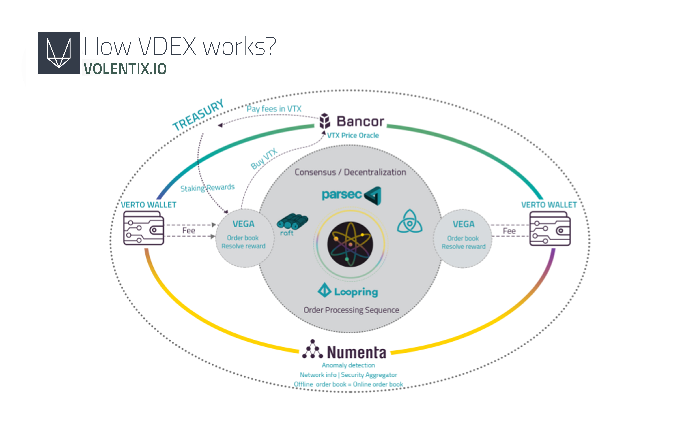
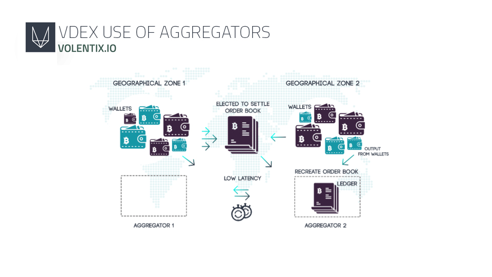
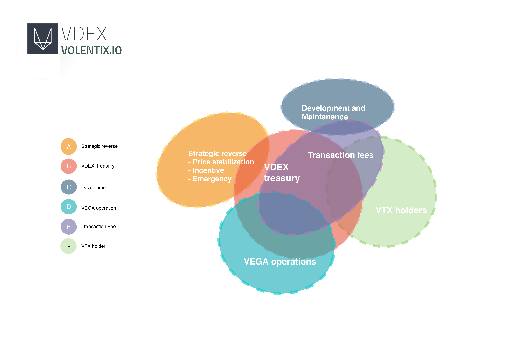
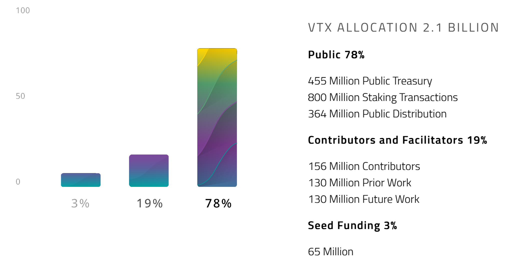
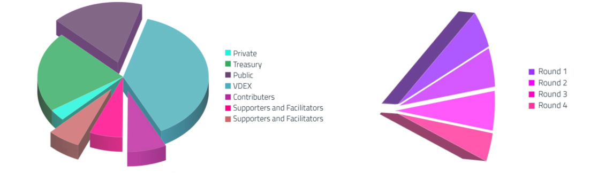

# IWE FUNFUN TI VOLENTIX VDEX

- Ẹyà: 0.1.4
- Ìmúdójúìwọ̀n waye ni: 11-03-2019
- Aaye ayelujara: www.volentix.io

## 1. IFIHAN

Volentix n ṣafihan VDex, ti o jẹ siseto gẹgẹ bi ibi ipasipaarọ ohun-ini oni-nọmba alaisilojukan, ti o jẹ pinpin pẹlu itẹramọ lori iriri olumulo ati idagbasoke awujọ ati iṣejọba. Nipa wiwọle si awọn imọ-ẹrọ ti o fẹsẹrinlẹ ati siseto yiyan awọn ilana titun ti o pataki aabo, iyara, ìfàṣẹsí, irọrun ti lilo, agbara iṣiṣẹ ṣi, ati atilẹyin ọlọpọ-ohun ini, VDex n gbero lati ṣọ awọn iṣowo ẹgbẹ́-sí-ẹgbẹ́ di irọrun nipa sisẹ atopọ awọn ohun elo alaisilojukan ti o jẹ gbigbe dede lori awọn iwe adehun EOS.IO to jafafa.

Aaye ifilọle VDex n ṣe ifojusọna fun sise ibamu awọn ibeere idalara ti Volentix si awọn imọ ẹrọ ti o wa nilẹ lori eto isẹ sise alaisilojukan EOS.IO. A gbero lati ṣe idanwo awọn erongba wa nipa ṣiṣe apẹrẹ awoṣe nipa akanṣe software EZEOS, eyiti a kọ ati ti a ṣe akanṣe rẹ pẹlu awọn irinṣẹ ila aṣẹ ti EOS.IO cleos. Software yi wa ni: https://github.com/Volentix/ezeos

## 2. VOLENTIX

Awujọ Volentix yoo duro le ori awọn opo mẹrin, ibi ibẹẹrẹ iseto awọn ohun elo ti a mọ si Venue, Verto, Vespucci, ati VDex ni pato.

### 2.1 VENUE

Venue jẹ gbigbekalẹ gẹgẹbi pilatifọọmu awujọ alayipada ti o n gba ati ṣiṣe aato awọn ọmọ ẹgbẹ ti awujọ Volentix lati jẹ ki pinpin VTX rọrun, ohun-ini oni-nọmba ibilẹ ti awujọ Volentix, ati lati ṣe ipolongo imọ nipa awọn eto Volentix.

Ifilọlẹ igbeyẹwo beta waye laipẹ, Venue n fun awọn olumulo laaye lati gba VTX ni paṣipaarọ, fun apẹẹrẹ, fun kikopa ninu sisẹ idagbasoke awọn awujọ ti o ni ifarajin, fifi awọn atunṣe asise ranṣẹ, ati gbigba awọn ẹbun. Awọn Patako-ipo ati awọn iwọn bosenlọ lọwọ jẹ afihan ikopa awọn olumulo. Ifihan ipolongo akọkọ jẹ fifilọlẹ lori https://bitcointalk.org/ forum ni Osu keje ọjọ kẹtala, ọdun 2018. Jọwọ ṣabẹwo https://venue.volentix.io fun alaye siwaju sii.

### 2.2 VERTO

Verto jẹ gbigbe dide gẹgẹbi apo owo olorisirisi-owo fun lilo pẹlu paṣipaarọ alaisilojukan ti VDex, o si ni ero lati mu irọrun ba ifipamọ ti ara ẹni ati iṣakoso ibilẹ ti awọn kọkọrọ ikọkọ ati kọkọrọ gbangba ninu awọn iṣowo ẹgbẹ-si-ẹgbẹ, pẹlu afojusun lati se imukuro awọn ewu ti awọn ipadanu oniparun ti isamisi ti o ni nkan ṣe pẹlu awọn ikuna ti awọn oṣiṣẹ iṣakoso aaringbungbu. Verto ngbero lati lo eto awọn iwe adehun to jafafa lati ṣetọju ipo ti o wa laarin awọn onibara iṣowo mejeji, awọn iṣẹ ti o rọrun julọ n jẹ ṣiṣe pẹlu awọn ipasiparọ alaini alagata. [1]

### 2.3 VESPUCCI

Vespucci jẹ fifojusun gẹgẹbi ohun elo iyanana ti o se wọle si nipasẹ intafeesi onirọrun-olumulo pẹlu awọn ile ipamọ iṣura ti bosenlọ lọwọ ati awọn itan data ọja, gẹgẹbi awọn iwontunwonsi awọn ohun-ini oni-nọmba ati awọn iyanana igbeyewo ero. A fẹ lati ro awọn olumulo lagbara pẹlu awọn irinṣẹ lati ṣe iwọn ati ṣe afiwe awọn ohun-ini oni-nọmba ti o ṣe fisowo, lati wọle ati pin awọn akọsilẹ itan iṣowo, lati ṣeto awọn aṣa ati awọn ilana, ati lati mojuto ati ṣayẹwo awọn idagbasoke software orisun-gbangba. Vespucci n wa lati mu wa si itosi awọn alaye ti o kun ati ti o gboya lori iṣowo ọja nipa sise akojọpọ awọn ijabọ alaye ti o lọwọlọwọ yii fọn kakiri gbogbo awọn oriṣiriṣi awọn blockchain, awọn aaye ayelujara, awọn yara itakurọsọ, ati awọn ibi iyipada.

### 2.4 VDEX

Opo kẹrin ti Volentix, ibi ipaṣipaarọ VDex, jẹ pilatifọọmu ṣiṣe owo awọn ohun-ini oni-nọmba ti a ṣe alaye ninu iwe funfun yii. Fun lilo ti o dan mọran ati ti o ni aabo, a gbero lati jẹki VDex ṣiṣẹpọ pẹlu apo owo Verto ti ara rẹ ati intafeesi Vespucci. A reti pe ki VDex ni anfani lati ṣakoso awọn iṣowo ti o jẹmọ VTX ati eto ọpọlọpọ awọn ohun-ini oni-nọmba ati awọn blockchain ti o si wa laye lati igba de igba jakejado agbalaye. A n se agbedide Venue gẹgẹbi alabaṣiṣẹpọ ni pato lati ma peṣe iwuri ati atilẹyin fun awọn eto-atinuda ibilẹ ti o da lori VTX.

## 3. IYAWORAN

#### 3.0.1 Eto Isẹ sise ori ẹrọ

A ti ṣe agbeyẹwo awọn orisirisi eto isẹ sise ori ẹrọ bi awọn oludije fun ipilẹ ti ibi ipaṣipaarọ VDex wa. Bi o tilẹ ṣepe a bọwọ fun iṣẹ ti awọn asaaju ti o ti fẹsẹrinlẹ ni idi awọn ohun-ini oni-nọmba ati imọ-ẹrọ blockchain ti se, ninu awọn assaju naa iṣẹ ti EOS.IO gẹgẹbi ilana eto isẹ ṣiṣe ti ori ẹrọ lori eyi ti a ti le se agbedide awọn ohun elo alaisilojukan da yatọ, ninu ero wa, bi awokọṣe. Software naa pese awọn akọọlẹ, ìfàṣẹsí, awọn ibi ipamọ data, ibaraẹnisọrọ alailo aago, ati ṣiṣe eto kari awọn iṣupọ. Awọn ẹya ohun elo ati awọn Ilana ti wa ni kikọ tẹlẹ sinu pilatifọọmu naa, ati pe ẹya kan le jẹ lilo lati le ni ibaamu pẹlu awọn ibeere VDex wa. VDex yoo kọkọ jẹ anfani lati ara awọn ẹya to pewọn ti EOS.IO n funni gẹgẹbi akọọlẹ ati sisẹda apo owo ati gbigba awọn kọkọrọ ti o jẹ jiji pada, ṣugbọn a gbero totẹlera lati ṣe amulo awọn ilana fun ṣiṣẹda ibi ipasiparọ alaisilojukan nipasẹ awọn iwe adehun EOS ati awọn irinṣẹ miran.[2] Eyi ni alaye isọniṣoki awọn ilana amoriya:

### Awọn Igbesẹ Alaini Aami itọka

Ọpọlọpọ awọn ilana ipele agbara odiwọn ti Ethereum gbero (Sharding, Raiden, Plasma, State Channels) tubọ sisẹ si, o ṣe mu dọgba, ati pe o bojumu nigba ti o n ṣe aridaju iyara ibaraẹnisọrọ laarin-blockchain ati aidibajẹ ipele agbara odiwọn. Igbesẹ Alaini Aami itọka jẹmọ awọn isiro ti o dalori idunadura data nikan, ko kin ṣe lori ipo blockchain.

### Iyipada Binary/JSON

Awọn iwe adehun EOS da anfani awọn eniyan lati leka JSON pọ mọ iṣiṣẹsi ti binari.

### Imudọgba ati imupeye

Yiya ifasẹsi sọtọ si ohun elo n faye gba ki akoko idunadura yara sii ati muki itankanlẹ pọ si. Awọn bulọọki EOS.IO n jẹ gbigbe jade ni gbogbo 500ms.

### Apejọ Ayelujara(WASM)

Apejọ Ayelujara jẹ ki iṣẹ ṣiṣe awọn ohun elo Ayelujara gaju si ati o tun da aabo bo ohun elo kọọkan ninu apoti ara rẹ, nipasẹ eyiti awọn iṣẹsi VDex le ri iwọle nẹtiwọki gba, awọn ihamọ aaye-orukọ faili-eto, ati aseyege ti o da lori ofin afipamu.

### Rust/C++ awọn iwe adehun

Ede siseto C++ ti o lokiki ati ti o gbajumọ farahan bi eyi ti o dara julọ fun WASM. C++ ni atilẹyin ati awọn ile ikowesi iṣatunṣe aṣiṣe alailẹgbẹ. Codebase EOS n lo awọn awoṣe lọfẹ, atipe C++ faye gba lilo awọn awoṣe ati apọju isẹ oṣiṣẹ lati seto akoko isẹ ọfẹ sise fun idaniloju ti awọn ẹya. Eto naa n ṣatunto si ipo imọfefe ni ibẹrẹ gbogbo ifiranṣẹ, anfani kan to dayatọ ti o n ṣe idanmọran agbekalẹ ti awọn adehun ajafafa. Ilana WebAssembly n ti atinuwa kọ eyikeyi idunadura ti o n se iranti ti ko ni ibaamu. Bi o ba ṣẹlẹ iyasọtọ iranti alayipada jẹ pataki, awọn olumulo le kuro lọ si awọn atọka to jafafa nitori awọn iwe adehun EOS.IO n lo C++ 14. O to kiyesi pe imuse akọkọ ti imọ ẹrọ PARSEC Directed Acyclic Graph (DAG) ni a reti ki o wa ni Rust.

#### 3.0.2 Awọn ifiranṣẹ ati ibi ipamọ data ti o da lori Eto alakalẹ

Awọn adehun iṣẹ jẹ mimudojuwọn lati pese ipilẹṣẹ odiwọn ti isisẹpọ laarin ati ninu awọn eto ti o yatọ nipasẹ sise asopọ awọn awoṣe data. Nitootọ, ilana Eto Adehun Adojuiwọn beere fun pe ki awọn adehun eto da lori awọn awoṣe data ti o dojuiwọn. Iyanana ma n jẹ ṣiṣe lori apẹrẹ iwe-akọọlẹ ti iṣẹ lati wa awọn iwe-iṣowo owo ti o n waye daadaa ti o n jẹ pipaarọ laarin awọn iṣẹ. Awọn iwe iṣowo yii ma wa jẹ ṣiṣe ni ọna ti o kun ojuiwọn. Ilana Eto alakalẹ ti eleto n mu adinku ba inilo fun ohun elo ti iparada idalara ilana awoṣe data naa. [3]

#### 3.0.3 Ibaraẹnisọrọ Laarin-Adehun

Data ma jẹ pinpin laarin awọn adehun nipasẹ oracle kan, eyi ti, "ninu ọrọ awọn blockchain ati awọn adehun ajafafa, jẹ aṣoju ti o n ṣawari ati se ijẹri awọn iṣẹlẹ bosenlọ gangan ni aye ati ki o fi alaye yii ranṣẹ si blockchain lati lo nipasẹ awọn adehun ajafafa." [4] Gbogbo oku ipade yoo ni ẹda ti o jọra ti awọn data wọnyi, fun lilo ninu iṣiro adehun ajafafa. Kakaki adehun ajafafa ṣiṣẹ lati fa data naa kuro, dipo oracle naa n tari data naa si ori blockchain naa. Ni apẹẹrẹ ti blockchain, ọpọ kika ti awọn data naa ma n jẹ ṣiṣe nipasẹ isewadi "awọn awoṣe" lati le se amojuto ipo blockchain ati lati ṣe diẹ ninu awọn igbesẹ idahun.

#### 3.0.4 Awọn ẹka-ẹgbẹgbẹ

Ni EOS.IO, ipinfunni ti ohun-ini oni-nọmba ma n ṣẹda ẹka-ẹgbẹgbẹ kan, eyi ti o jẹ ilana ti o n jade bọ ti o gba awọn ohun-elo oni-nọmba laaye lati jẹ lilo pẹlu aabo lati blockchain kan ninu blockchain miran ti o yatọ ati lẹhinna jẹ didapada si ojulowo blockchain. Iṣiṣẹṣi ti iṣaayan ma n jẹ gbigbelarugẹ nipasẹ ṣiṣẹda awọn ọpọlọpọ awọn ẹka-ẹgbẹgbẹ. Ikanni ibaraẹnisọrọ kan to dabi ti TCP laarin awọn oniruuru blockchain n ṣe igbelewọn awọn ẹri. Fun ọkọọkan ege (ẹya kan ti o jẹ aseyege oniṣiṣẹntẹle ni iyipo kan), igi merkle pipeye kan ma jẹ gbigbe dide ti awọn ifarajin igbeṣẹ wọnyi lati ṣe ipilẹṣẹ gbongbo merkle alajọpin onigbadiẹ kan; eyi n jẹ ṣiṣe fun iyara ti iṣiro oniṣiṣẹntẹle. Akoori bulọọku naa ni gbongbo igi merkle pipeye kan eyi ti awọn ewe rẹ jẹ gbongbo ti awọn ọkọọkan ege awọn igi merkle yii. [2]

#### 3.0.5 Irọrun isọjadowo

Ohun-ini oni-nọmba jẹ owo lọwọ ti o ba jẹ tita tabi rira ni awọn iwọn iṣowo laisi ipa ọlọjọ kukuru ti o han lori iye owo ọja lọwọlọwọ. Lati le de iru ipo bayii, nigbagbogbo eyikeyi awọn dukia ti o se ṣowo gbọdọ bori ipele awọn iwọn iṣowo ti o to lati ṣe atilẹyin fun iduroṣinṣin. Ni pato, a ni ireti lati samulo awọn ọna wọnyi: Ilana Loopring pẹlu lilo awọn adehun EOS.IO ti n ṣiṣẹ bi awọn oju ipade. [5] Alugọridimu Bancor to jẹ lilo lati mu iduroṣinṣin ba dukia oni-nọmba [6] N sayipada asaayan laarin awọn Ilana naa ati HTLC (awọn ipaṣipaarọ alaini alagata) ni ibamu si awọn iyanana Vespucci lori nẹtiwọki VDex.

#### 3.0.6 Awọn adehun to ti jẹ Gbigba to wani Akoko atipa ( Awọn ipasipaarọ Alaini alagata)

Adehun to ti jẹ Gbigba to wani Akoko atipa (HTLC)[1] jẹ adehun ajafafa ti o n jẹ ki imuṣiṣẹ awọn iṣowo ti akoko de waye. Awọn olumulo yoo ni orisirisi akoko atipa fun awọn iṣowo wọn, pẹlu ẹdinwo lori awọn owo iṣowo ni paṣipaarọ fun yiyan akoko atipa to gun gan.

### 3.1 ILANA ATOPỌ NẸTIWỌKI

#### 3.1.1 Awọn oju ipade

Awọn oju ipade ni awọn opin ti ibi ipaṣipaarọ VDex. Awọn iṣẹ wọn ni:

1. Ṣiṣẹ bi awọn ọna abawọle si VDex nipasẹ apo owo Verto.

2. Ṣe adapọ alaye iwe ibeere.

3. Yanju iwe ibeere.

4. Ṣakoso ibeere to di fifagile.

5. Yan akoko idawọduro fun awọn ilana RAFT.

6. Pilẹṣẹ awọn adehun fun awọn ibeere ti o ti jẹ fifọwọsi.

Awọn oju ipade gba ipin kan lara owo fun iṣowo kọọkan. Ti olumulo kan ba ni owo to peye ati ti o si ni akọsilẹ aseyọri daradara, apo owo Verto rẹ le ṣiṣẹ bi oju ipade kan.

#### 3.1.2 Awọn alakopapọ

Awọn alakopapọ VDex jẹ fifarajin si isakoso Volentix fun ẹrọ afidanrawo ati awọn eredi aabo. Ọkan ninu awọn iṣẹ wọn ni lati fa awọn akọṣilẹ ati ṣe ibeere data iwe lati ọdọ awọn oju ipade sinu awọn isoju pinpin to fọnka fun iranti alakoko onipele ipo bi iyanana [7] ifiran fun iwajade awọn ohun ajeji ninu eto naa. Awọn alakopapọ yoo tun jẹ olugbalejo si awọn ẹya ara miiran gẹgẹbi awọn lẹja metachain ati awọn olufà alaye ti blockchain.

#### 3.1.3 Latẹnsi

Latẹnsi ijẹrisi bulọọku EOS.IO kere (isẹju aaya 0.5).[5] Ipo latẹnsi yii tubọ le ṣe lo ninu awọn iṣowo pẹlu awọn blockchain miiran ti awọn asopọ naa ba n gba iru latẹnsi yii kanna. Ṣugbọn ni pataki iṣowo naa ma jẹ yiyara to bi iyara ti asopọ to lọra ju ninu eto ba se to. O jẹ mimọ daradara, fun apẹẹrẹ, pe bulọọku Bitcoin nilo to deede iṣẹju mẹwa fun isaayan. Gbigba hash iṣowo kan ko tumọ si pe iṣowo naa jẹ jijẹrisi; o kan tumọ si pe oju ipade kan ti gba iṣowo naa laisi aṣiṣe, biotilejẹpe o ṣeeṣe gidi gan ki awọn olusẹda bulọọku miiran gba wọle.

### 3.2 IWE IBEERE

Iwe ibeere ni akojọ awọn ibeere rira-ati-tita ti VDex n gbasilẹ lati ọdọ awọn olumuloto nifẹsi. Ẹrọ kan ti o ni baamu n lo iwe ibeere lati mọ iru awọn ibeere ti o le jẹ mimuṣẹ. Awọn ilana Loopring n fayegba lati ṣe akanṣe eto data iwe ibeere [5] Awọn apoti ti EOS.IO n pese le ṣee lo fun iṣiṣẹ ẹlẹkunrẹrẹ. [8]

#### 3.2.1 Awọn ẹya data

Lilo Ilana ila oniyipo ti FIFO Loopring (akọkọ-wọle akọkọ-jade), awọn oju ipade le ṣeto ki awọn iwe ibeere wọn ma ṣafihan ati ṣe ibaamu ibeere olumulo kan. Ọna yii n tẹle awoṣe OTC, nibiti opin awọn ibeere ti wa ni ipo ti o da lori owo nikan.[5]

Titọkasi API alatẹnumọ ti EOS.IO, iwe ibeere ri aaye lati lo anfani apoti alagbara ọlọpọ-atọka to jẹ ajọpin laarin awọn oju ipade nipasẹ akọọlẹ EOS.IO kanna.

#### 3.2.2 Iwe ibeere Ori-ila

Iwe ibeere ori-ila jẹ akọsilẹ awọn afilọ ti o n gbe lori apo owo naa (oju ipade) ti o jẹ yiyan lati yanju iwe ibeere naa. O n gbe ni ibi ipamọ data alatẹnumọ lori oju ipade kọọkan ti o ṣe alabapin si akọọlẹ kanna bi ti gbogbo awọn oju ipade miiran.

#### 3.2.3 Iwe ibeere Alaisilori-ila

O n gbe lori alakopapọ, awọn iwe ibeere alaisilori ila n sisẹ fun ẹrọ afidanrawo ati awọn eredi aabo.

#### 3.2.4 Ilana alaisilojukan ti iyanju iwe ibeere

Fun awọn idi alaisilojukan, awọn oju ipade yoo ma to lati yanju iwe ibeere. Oju ipade to n yanju gbọdọ jẹ yiyan sipo nipasẹ ilana ati gbogbo awọn atẹwọle iwe ibeere lati gbogbo awọn oju ipade gbọdọ wa nilẹ si awọn oju ipade to n yanju. A gbagbọ pe awọn ilana iṣọkan RAFT[9] ati PARSEC[10] n pese awọn ọna abayọ to munadoko. RAFT jẹ alugọridimu to fẹsẹrinlẹ daradara ati ti o rọrun lati muṣiṣẹ.[7] PARSEC jẹ tuntun ati o si munadoko, nipa lilo imọ ẹrọ Directed Acyclic Graph (DAG) ati ṣiṣe imukuro inilo fun didaakọ awọn akọṣilẹ.

### 3.3 IYANJU IBEERE

Iyanju ibeere ni awọn eroja to jọra ti awọn iṣowo ọja owo ti alaiyatọ. Lilo imọ ẹrọ FIFO lati ṣe idalara iwe ibeere, VDex n pinnu lati ṣayẹwo ibeere, iwe-akọọlẹ ohun-ini, ati iwọn ifọwọsi, ati ni bakanna mu adinku ba awọn ibeere ati awọn ifagile. 

### 3.4 VTX

#### 3.4.1 Ipinfunni ati Iwulo VTX

VTX jẹ ohun-ini abinibi oni-nọmba ti o ma jẹ pinpin jade ati jẹ lilo lori ibi ipaṣipaarọ alaisilojukan ti VDex. A lọwọlọwọ gbero lati lo adehun aami eos.io lati ilana ti EOS.IO lati pin aami VTX ti o jẹ biliọnu 2.1 ti o ni ibaamu pẹlu EOS.IO pẹlu ipese ti o jẹ biliọnu 1.3. VTX yoo ni orisirisi ọpọlọpọ iwulo, fun apẹẹrẹ:

Lati san èrè fun awọn olukopa ninu ilana iṣọkan ati ninu awọn ipolongo Venue.

Lati san ati ṣe atunpin awọn owo iṣowo lori ibi ipaṣipaarọ VDex.

Lati fi silẹ ati di ibo lori awọn igbero si awujọ ti Volentix, lilo awọn ẹtọ idibo ti o jẹ pinpin fun awọn olumudani VTX.

Lati pese atilẹyin fun atunyẹwo awọn igbero ati amuṣiṣẹ awọn iṣẹ akanṣe.

Lati peṣe iwuri fun awọn olumulo lati kopa ninu iyanju iwe ibeere nipa dida awọn oju ipade nipasẹ awọn apo owo Verto wọn.

Lati peṣe iwuri fun awọn olumulo lati ti owo pa fun> wakati 24 nipasẹ awọn iṣowo HTLC ti akoko de.

#### 3.4.2 Pinpin VTX

Awujọ ohun-ini oni-nọmba kan nilo orisirisi awọn eroja pataki kan ti o jẹ ti eniyan ti o n ṣe itukọ iṣẹ akanṣe naa siwaju.[11] O ṣe pataki lati san owo iwuri fun awọn ẹni naa fun ikopa wọn. Dida lori atunṣe, Volentix lọwọlọwọ n ṣe ifojusọna fun awọn ipin wọnyi:

1. Awọn olulọwọsi. 12%. Oriṣiriṣi awọn eniyan kan, to sunmọ awọn oludasilẹ, ti o n ṣe ilọwọsi pẹlu awọn oye, akoko ati talẹnti, botilẹjẹpe wọn ma n ṣiṣẹ ni ọpọ igba laisi ipese owo iwuri ni kiakia.

2. Awon alatilẹyin.

Ipele 1. 5%. Awọn olupese owo ni ibẹrẹ pẹpẹ.

Ipele 2. 28%. Awọn olupese owo nipasẹ awọn tita-iṣaaju ti ikọkọ ati tita ti gbangba ti o ṣeeṣe to kun ojuiwọn.

3. Awọn oluṣeto. (Awọn oludamọran, Awọn olugbedide, Awọn olupolowo, Awọn oluṣọ). Kiyesi pe awọn ibeere fun iranlọwọ lati awọn ipin-ẹka ninu ẹka yii le yatọ gidi gan ṣaaju ki ati lẹhin ti iṣẹ akanṣe naa gba owo atilẹyin ti o lapẹrẹ, ṣugbọn awọn eniyan kan le ṣiṣẹ ni awọn ipele mejeeji.

Ipele 1. 10%.

Ipele 2. 10%.

4. Isura alaisilojukan. 35%. Awọn eniyan awujọ peṣe iwuri ati san èrè fun ikopa ninu idagbasoke onitẹsiwaju ti ajọ aladase alaisilojukan (DAO). Isura alaisilojukan n jẹ fifojusọna fun lati jẹ lilo nipasẹ awọn adehun ajafafa ati iṣọkan awujọ. 

#### 3.4.3 Pinpin VTX

Ni ibamu si awọn ipo ọja ni akoko ti ikọwe yii, Volentix n gbero lori akoko, awọn ọna, ati awọn alaye ati awọn adehun ti pinpin VTX gẹgẹbi iṣẹ ti awọn tita-iṣaaju ti ikọkọ ati tita ti gbangba ti o ṣeeṣe. Jọwọ mojuto aaye ayelujara wa fun awọn ifitonileti.

### 3.5 ISAMULO PILATIFỌỌMU EOS.IO

Awọn imọran wọnyi ni o ṣe pataki si bi a se fi imulo ibi ipaṣipaarọ VDex si ori pilatifọọmu EOS.IO:

Lilo adehun ni idiyele sugbon ominira wa lati lo.

Awọn olugbedide n lo aami ti o ni ibamu pẹlu EOS.IO lati ṣamulo adehun ajafafa kan. Lẹhin ti adehun naa ti jẹ lilo, awọn aami ti o wa ni atipa jẹ didapada.

Awọn ohun elo alaisilojukan n pin iranti, CPU, itankanlẹ, ati awọn ohun elo miiran si awọn adehun wọn.

Awọn ifiranṣẹ ọlọpọ ati awọn akọọlẹ ọlọpọ le jẹ pinpin si okun kanna.

### 3.6 IFỌRỌWERỌ BLOCKCHAIN

#### 3.6.1 Ibaraẹnisọrọ Laarin-Blockchain

EOS.IO jẹ ṣiṣe lati jẹ ki awọn ẹri Ibaraẹnisọrọ Laarin-Blockchain (IBC) fuyẹgẹgẹ. Fun awọn asopọ ti ko ni ikapa ti o to fun isaayan awọn ẹri IBC ati ṣiṣe ifẹsẹmulẹ iwulo, aaye wa lati kuna si awọn oracle/alagata ti a jẹri. Pẹlu adehun ajafafa ti o da lori EOS.IO, apo owo ọlọpọ-ibuwọlu ti a jẹri ti o n ṣetọju ohun-ini ni ọdọ alagata le ṣee lo lati ṣe iyilọkanpada si bibuwọlu/titẹjade ti iṣowo naa dida lori awọn ẹri IBC lati orisun asopọ.

#### 3.6.2 Alaye Ọpọ-Blockchain

Alaye ni yeke ti ọlọpọ-blockchain le ṣee gba nipasẹ ṣiṣe akopọ awọn isẹlẹ pataki ni sisẹntẹle (pẹlu iyatọ ninu bi iyipada ipo ṣe n waye si). Eto yii le fa ki awọn ẹrọ amusẹdọgba ọlọpọ-asopọ bẹrẹ isẹ, awọn ipo gbigbe kiri, fa awọn data abajade lati ọdọ awọn adehun ajafafa, ati aseyọri iṣowo blockchain ti okeere. Ibatan ijinna si bulọọku, ibatan ipo agbaye, ati awọn iṣẹlẹ olontẹ akoko n jẹ kikọsilẹ sori lẹja agbaye lati mudojuiwọn ati jẹrisi awọn iṣowo ṣaaju ki wọn to ṣẹlẹ gangan lori asopọ ibilẹ. Ilana yii tun le jẹ lilo lati ṣe ipinnu iṣe kongẹ igbejade bulọọku laarin awọn asopọ lati wọle si irọrun isọjadowo ti o tubọ tobi.[12]

### 3.7 AWỌN IFIYESI NIPA AABO

Lati gbọn awọn abamoda kan danu, a gbero lati bẹrẹ idanwo aabo ni atẹle si ipele apẹrẹ awoṣe. Awọn ifiyesi nipa aabo jẹ eyi ti iwulo rẹ se pataki julọ si awọn olumulo ti o si gbọdọ jẹ mimojuto. Awọn ihalẹ pẹlu, fun apẹẹrẹ, olutako kan ti o n saayan koodu oloro laarin iṣowo kan tabi ṣe atunṣe ibeere awọn iṣowo tabi awọn ontẹ akoko ti awọn bulọọku. Ni awọn abala wọnyi, a ṣamojuto awọn igbesẹ aabo kan ati awọn pato ihalẹ aabo ati awọn atunse wọn.

### 3.8 AWỌN IGBESẸ AABO

#### 3.8.1 Aabo olubasọrọ

De ọpọlọpọ awọn owo mọlẹ ninu akọọlẹ oniṣakoso-ọlọpọ-ibuwọlu, ti akoko daduro.

Lo awọn ọpọ-ibuwọlu lori hot wallet pẹlu ọpọlọpọ awọn ilana ti olominira/awọn server ti o n ṣe atunyẹwo gbogbo awọn iyọkuro, pẹlu awọn anfaani ti o wa pẹlu ṣiṣẹda akojọpọ awọn akọọlẹ ti fọkantan.

Lo akanṣe adehun kan ti o fayegba awọn iyọkuro nikan si awọn akọọlẹ ti o jẹ jijẹrisi nipasẹ KYC/AML.

Lo akanṣe adehun kan ti o fayegba awọn ifidogo ti awọn ohun-ini ti o jẹ mimọ nikan lati awọn akọọlẹ ti o jẹ jijẹrisi nipasẹ nipasẹ KYC/AML.

Lo akanṣe adehun kan ti o nilo akoko idaduro wakati 24 to pọn dandan fun gbogbo awọn iyọkuro.

Lo awọn adehun pẹlu awọn apo owo ti afojuri fun gbogbo bibuwọlu, pẹlu fun awọn iyọkuro aladaaṣiṣẹ.

Satunse awọn adehun to bajẹ.

Se afikun anfani lati da iṣẹ ṣiṣe ti adehun kan duro.

Se afikun anfani lati da igbeṣẹ ti adehun kan duro.

#### 3.8.2 Ṣiṣayẹwo awọn ilana ẹlẹtan

Awọn alugọridimu iṣawari aiṣedede to tubọ ga to jẹ pipese nipasẹ ile ikowesi ti Numenta Nupic yoo nilo awọn eto data ikẹkọ to kere ju awọn ilana AI ti o wọpọ julọ.

#### 3.8.3 Isọdialaileto

Isọdialaileto olotitọ ti aaye eto adirẹẹsi, ipa ọna tabi lilo awọn akoko idawọduro ti olorisirisi gigun bi ti complexninu ilana RAFT le mu awọn eto le si ti o to lati mu ifarada gboro si ati tubọ da aabo bo awọn eto kuro nibi awọn ikọlu ikanni-ẹlẹgbẹ kan tabi ti aṣaaju.

#### 3.8.4 Iṣabẹwo akọṣilẹ

Parsec ko gbọkanle awọn akọsilẹ fun ipinnu ti ipohunpọ. Ni ọna miiran, RAFT yoo nilo eyi. Bose wu kori, Awọn oju ipade asedaniloju ma jẹ siseto lati nilo alaye bintin Lati mọ ipohunpọ lati mu adinku ba akoko isaayan iṣowo naa.

#### 3.8.5 Iṣowo gẹgẹbi Ẹri ti Idokowo(TaPoS)

Ilana eto yii n ṣe idena atunṣe ti iṣowo kan lori awọn ẹka ti ko ni bulọọku ti a tọkasi naa. N fun nẹtiwọki naa lọwọ pe pato olumulo kan ati ipin idokowo kan wa lori pato ẹka kan.

### 3.9 Awọn ihalẹ aabo ati awọn atunse

#### 3.9. Inawo ẹlẹmeji

Inawo ẹlẹmeji jẹ ikọlu eyi ti pato ipin idokowo owo kiripito kan ti jẹ nina ninu iṣowo to ju ẹyọkan lọ.

Ikọlu idije ma n waye nigbati awọn iṣowo onitako meji ba jẹ fifiranṣẹ ni sisẹntẹle si inu nẹtiwọki naa.

Ikọlu Finney ma n ṣe iwakusa-iṣaaju ti iṣowo kan sinu bulọọku kan atipe o ma naa awọn aami kanna ṣaaju itusilẹ bulọọku naa lati fagile idaniloju iṣowo naa.

Ikọlu 51% le jẹ gbigbekalẹ nipasẹ ẹnikẹni ti o ni kọja ipin 50% ti agbara isiro apapọ ti nẹtiwọki kan. Ipo olohun to pọ julọ fayegba idapada eyikeyi iṣowo ati fayegba gbogbo iṣakoso yiyan awọn iṣowo ti o n farahan ni awọn bulọọku. EOS.IO, Loopring, ati RAFT han gẹgẹbi eyi ti o ti dena iṣoro yii. Ti olugbe bulọọku jade ba gba akoko isẹ sise to pọju boṣeyẹlo tabi ko ni ere ti o to, ajẹwipe ilana naa jẹ fifi si akojọpọ iyago fun.[5]

#### 3.9.2 Ti o siwaju

Asiwaju ma n ji ibeere kan tabi ju bẹlọ kuro ninu iyanju iwe ibeere iṣowo ti o wa ni asorọ. Awọn EOS.IO ati Loopring n pese awọn atunṣe ni eyiti awọn kọkọrọ ti ni idaabobo nitori pe wọn ko si ni ara iṣowo ori-ila, ati nitorina jẹ aimọ si awọn ẹlomiran ayafi ẹniti o ni. Oju ipade iyanju iwe ibeere nikan ni o ni alaye ti o se kókó, atipe oju ipade kọọkan n lo ọna abayọ miiran fun yiyanju awọn iwe ibeere, ṣiṣe afihan ipele ti itakoko miiran sibẹsibẹ lati ṣe igbelarugẹ aabo.

#### 3.9.3 Awọn idanimọ ayederu

Awọn olumulo onisuta n ṣẹda awọn idanimọ ayederu lati fi nọmba nla ti awọn ibeere keekeke ransẹ lati kọlu awọn oju ipade Loopring. Amọ sa, ọpọ ninu awọn ibeere yii yoo jẹ kikọ fun ailere ti o to funni ni itẹlọrun nigbati asopọ waye.

#### 3.9.4 Aito Iye ti o ku

Awọn olumulo onisuta n buwọlu ati ṣe itanka awọn ibeere eyi ti iye wọn kii ṣe odo sugbọn eyiti iye to ku ninu adirẹẹsi naa jẹ odo. Awọn oju ipade n mojuto awọn iye to ku gangan, ṣe imudojuiwọn awọn ipo ibeere wọnyi gẹgẹbi o ṣe yẹ, ati lẹhinna da wọn nu.

#### 3.9.5 Timing attack

Timing attacks are a class of cryptographic attacks through which a third-party observer can deduce the content of encrypted data by recording and analyzing the time taken to execute cryptographic algorithms. The RAFT algorithm prevents timing attacks by using randomness of timeouts.

### 3.10 USER EXPERIENCE

Our focus on user experience is primary. We wish to make VTX and the four pillars of Volentix -- Venue, Verto, Vespucci, and VDex -- easily accessible to and useable by all those who wish to join our community. We expect the experience continually to be educational as well, with templates and simulators to support a superior UX/UI relationship.

### 3.11 TRUE DECENTRALIZATION

EOS.IO is an open-source, scalable infrastructure for decentralized applications. Its goal is a fair and transparent block producer (BP) election process utilizing a democratic delegated proof of stake (DPoS) consensus. Particularly as such a system just begins to proliferate, there will be glitches. Therefore, some degree of retained centralization is inevitable and necessary. Ṣugbọn akọmọna itọnisọna wa jẹ ti alaisilojukan, ati awọn igbiyanju wa ti n lọ lọwọ jẹ fifojusun lati ṣe ipolongo mimu adinku ba gigbarale iṣakoso olojukan.

Fun apẹrẹ, ni iṣaaju a ṣe ipinnu lati se agbekalẹ eto kan fun yiyan awọn oju ipade (nigbati o ba n yanju awọn iwe ibeere) ti ko ni lo aago alajọpin olojukan tabi DPoS ṣugbọn dipo o ma da lori awọn akoko idawọduro alaileto fun siṣe ipinnu awọn olori ninu idibo kan (RAFT) tabi lori Directed Acyclic Graph (DAG) ninu ilana PARSEC.

### 3.12 IMUBỌSIPOPADA TI ETO

Awọn ilana RAFT ati PARSEC pese eto ti o lagbara fun imubọsipopada ti ikuna oju ipade ba waye. Awọn igbesẹ aabo naa tun jẹ pipese fun iṣowo laarin ati ninu awọn blockchain abinibi. Ti asopọ kan ba kọ idanimọ, eto naa ma bọ si bulọọku to kan tabi atipa onigbadiẹ.

### 3.13 IYAWORAN TO N YI

Awọn ikede ojoojumọ ti awọn agbedide koodu tuntun to n ni ipa lori ilo awọn ohun-ini oni-nọmba safihan anfaani nla ti akọmọna koodu orisun-gbangba. Awa ni Volentix da mọ pe awa ni olujẹ awọn anfani ti awọn ohun elo owo nla ti o jẹ yiyasọtọ nipa ọpọlọpọ awọn ti o tete kopa lati ṣe idagbasoke awọn ohun elo ohun-ini oni-nọmba ni ati bi ọdun mẹwa sẹyin. Ni bayii a ti ni anfani lati gbe igbesẹ to kan nipa ṣiṣẹda VDex, ibi ipaṣipaarọ alaisilojukan fun iran awọn iṣowo ohun-ini oni-nọmba ti o n bọ.

## 4. AWỌN ERO IGBẸHIN

Gbogbo wa ni Volentix n fi iṣẹ wa ati awọn oye wa jin si ṣiṣe igbedide eto kan ti o da lori ironilagbara ati ominira. Ti o ba ni ero lati darapọ mọ wa, ni eyikeyi aaye, nigbana jọwọ ṣe bẹ ati jọwọ ni ẹkọ lori awọn akori ti o wa ninu iwe funfun yii ati awọn afikun iwe atẹjade ti Volentix afikun bi a ṣe pin wọn pẹlu awujọ wa.

## 5. ATẸ ISẸLẸ

Jọwọ mojuto aaye ayelujara wa ati awọn ikanni ajọlo fun awọn ifitonileti ati awọn ikede pataki miiran. O ṣeun pupọ fun itẹtisilẹ ati inifẹsi rẹ.

## IKỌJALẸ

Iwe funfun jẹ pipese, o si jẹ gbigbekalẹ, fun awọn idi alaye nikan. Ifitonileti to jẹ gbigbekalẹ naa ko jẹmọ pe o kun fọfọ. Ifitonileti naa jẹmọ ki o ni ayipada ni odidi tabi ni apakan ni eyikeyi akoko laisi ikede. Awọn Laabu Volentix ni ẹtọ lati ṣe atunṣe, rọpo, yọ kuro, tabi pa eyikeyi ati gbogbo alaye rẹ pẹlu ifẹ inu ati ipinnu ti o jẹ ti Volentix nikan soso. Awọn Laabu Volentix ko ṣe aṣoju tabi majẹmu atilẹyin kankan, ṣafihan tabi ṣe itumọsi, nipa ti iṣedeede tabi aṣepari ti ifitonileti naa ati ṣe ikọjalẹ kedere ti eyikeyi ati gbogbo gbese ti eyikeyi ati gbogbo eyiowu ti ki ba jẹ fun ifitonileti ti o wa ninu ẹ tabi ti ko si ninu ẹ. Awọn Laabu Volentix nilo ki ọkọọkan ati gbogbo oluka ka alaye naa ni kikun ati ni ifarabalẹ, ati lati ṣe iwadi ti ara ẹni ati iyanana ti alaye naa, ati lati wa ati gba imọran ọjọgbọn fun awọn idi ti ṣiṣe igbelewọn alaye naa. Si imọ ti awọn Laabu Volentix, kosi igbimọ idari, ijọba, tabi ifipamu ti alagata miiran bi atunyẹwo ṣe waye, jẹ gbigbelewọn, tabi jẹ fifọwọsi eyikeyi apakan tabi gbogbo alaye naa. Alaye yii ko kin ṣe ipese tabi ibeere iru eyikeyi botiwukori ati pe ko kin ṣe ipilẹ fun eyikeyi adehun tabi ifarajin iru eyikeyi botiwukori. Gbolohun kankan ti o ba jẹ kika si onitẹsiwaju jẹ ọrọ ti imọran nikan, ati pe oluwoye kankan ko gbọdọ gbarale iru gbolohun bẹ tabi apakan tabi gbogbo alaye naa ni eyikeyi ọna.

## ỌRỌ IWOYE

1. K. Kurokawa, Atomic cross chain transfer, an overview, (2015).

2. EOS.IO, Eos.io technical white paper v2, (2018).

3. T. Earl, Soa principles of service design, (2016).

4. blockchainhub.net, blockchain-oracles, (2017).

5. F. Zhou, Wang, Loopring: A decentralized token exchange protocol, (2018).

6. G. B. Eyal Hertzog, Guy Benartzi, Bancor protocol: Continuous liquidity for cryptographic tokens through their smart contracts, (2018).

7. L. Lamport, The part time parliament, (1998).

8. D. Larimer, eosio.boot telegram chat, (2018).

9. J. O. Diego Ongaro, In search of an understandable consensus algorithm, (2018).

10. F. H. Q. M. S. S. Pierre Chevalier, Bart lomiej KamiÂťnski, Protocol for asynchronous, reliable, secure and efficient consensus (parsec), (2018).

11. Dane Keller Rutledge, Fundamental Human Constituents of a Digital Assets Ecosystem (DAE). (2018).

12. BlockColliderTeam, Block collider white paper, (2018).

## SUPPLEMENTAL REFERENCES

Aelf, A multi-chain parallel computing blockchain framework, (2018).

ARK, A platform for consumer adoption, (2018).

V. Buterin, Ethereum: a next generation smart contract and decentralized application platform, (2013).

S. Cormier, A machine based societal model for curbing citizen cynicism, (2017).

M. Duncan, Quale, Halo platform, (2018).

S. D. K. M. T. S. H. Garcia-Molina, The eigentrust algorithm for reputation management in p2p networks, (2018).

M. R. Garrick Hileman, Global cryptocurrency benchmarking study, (2017).

D. K. M. T. S. H. Garcia-Molina, The eigentrust algorithm for reputation management in p2p networks, (2018).

Q. Liquid, Providing liquidity to the non-liquid crypto economy, (2018).

S. R. M.P.M-S, Aniket Kate Matteo Maffei, Concurrency and privacy with payment-channel networks, (2017).

SingularityNET, A decentralized, open market and inter-network for ais, (2018).

M. M. Timo Hanke and D. Williams, Dfinity technology overview series consensus system, (2018).

A. B. Will Warren, 0x: An open protocol for decentralized exchange on the ethereum blockchain, (2017).

G. Wood, Ethereum: A secure decentralised generalised transaction ledger.ethereum project yellow paper, (2014).

Dane Keller Rutledge, Creating a Comprehensive Digital Assets Ecosystem (DAE), (2018).

## OPIN IWE